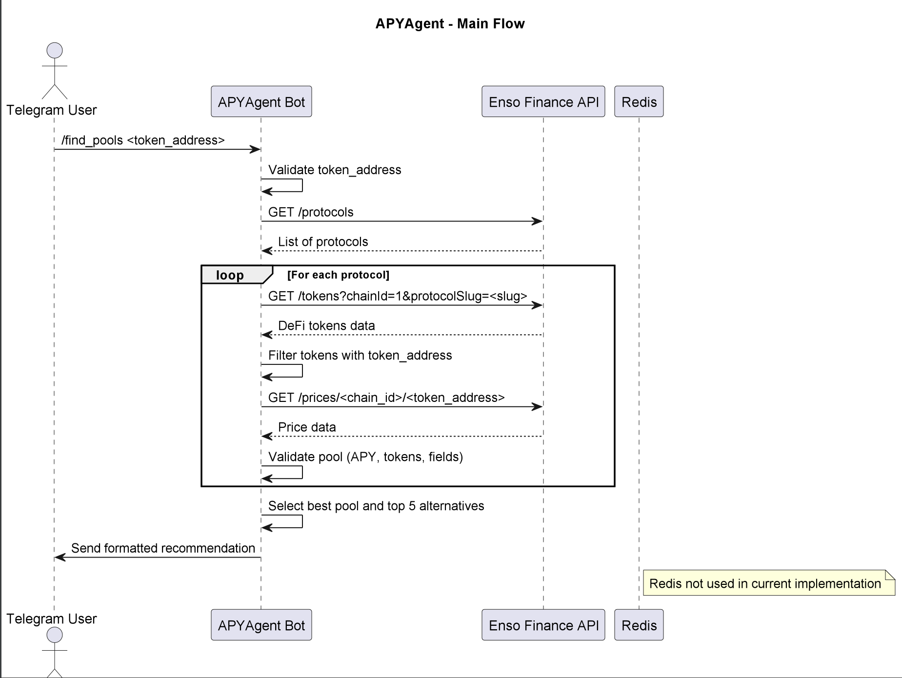

# APYAgent

## Purpose & Scope
APYAgent is a Telegram bot that interacts with the Enso Finance API to find and recommend secure DeFi investment pools for a specified token, ensuring safe and high-yield opportunities.

## Prerequisites
- Python 3.10+
- Telegram Bot Token (obtained from BotFather)
- Enso Finance API key
- Redis is not required, but a stable internet connection is needed for API requests
- Dependencies from PyPI (listed in `requirements.txt`)

### Required Environment Variables
- `TELEGRAM_BOT_TOKEN` — Telegram Bot API token
- `ENSO_API_KEY` — Enso Finance API key for accessing DeFi data

## Quickstart
1. **Install dependencies:**
   ```bash
   pip install -r requirements.txt
   ```
2. **Set environment variables:**
   ```bash
   export TELEGRAM_BOT_TOKEN="your-telegram-bot-token"
   export ENSO_API_KEY="your-enso-api-key"
   ```
3. **Run the bot:**
   ```bash
   python apy_agent/main.py
   ```
4. **Interact with the bot in Telegram:**
   - Start the bot with `/start`
   - Find pools with `/find_pools <token_address>`, e.g.:
     ```bash
     /find_pools 0xA0b86991c6218b36c1d19D4a2e9Eb0cE3606eB48
     ```

**The agent will:**
- Authenticate with the Enso Finance API
- Retrieve a list of supported protocols and DeFi tokens
- Identify safe pools with valid APY (0.1%–100%) for the specified token
- Return a formatted recommendation with pool details in Telegram

# Architecture & Flow

## Overview

APYAgent is a Telegram bot built with `aiogram` that interacts with the Enso Finance API to find and recommend secure DeFi investment pools for a given token address. It validates pools based on safety criteria and returns a formatted recommendation via Telegram.

## Component Diagram

See [`ai_apy_pool_agent_diagram`](images/diagrams/ai_apy_pool_agent.png) for a high-level sequence diagram, including:
- Telegram User interacting with the bot
- APYAgent Bot processing requests
- Enso Finance API as the external data source
- Redis (not used in the current implementation but included for potential caching)

## Flow Description

1. **User sends `/find_pools <token_address>`** via Telegram.
2. The bot:
   - Validates the provided token address.
   - Queries the Enso Finance API to retrieve a list of supported protocols.
   - For each protocol:
     - Fetches DeFi tokens for the specified chain (default: `chainId=1`).
     - Filters tokens containing the provided `token_address` in their underlying tokens.
     - Retrieves price data for underlying tokens to ensure they are active.
     - Validates each pool based on safety criteria:
       - APY between 0.1% and 100%.
       - At least two underlying tokens.
       - All required fields (`chainId`, `address`, `decimals`, `type`, `protocolSlug`).
       - Active underlying tokens with valid, recent prices.
   - Selects the pool with the highest APY and up to five alternatives.
   - Formats a Markdown recommendation with pool details (APY, protocol, token addresses, etc.).
3. The bot sends the recommendation back to the user via Telegram.

# API & Configuration Reference

## Public Interface

APYAgent is a Telegram bot and does not expose a traditional REST API. Instead, it provides Telegram commands that interact with the Enso Finance API to process user requests. The primary command is documented below.

### `/find_pools <token_address>`

Initiates a search for secure DeFi investment pools for the specified token address.

#### Parameters

- `token_address` — The Ethereum token address to search for (e.g., `0xA0b86991c6218b36c1d19D4a2e9Eb0cE3606eB48`)

**Example:**

```bash
/find_pools 0xA0b86991c6218b36c1d19D4a2e9Eb0cE3606eB48
```
#### Behavior

- Validates the provided token address.
- Queries the Enso Finance API for supported protocols and DeFi tokens.
- Filters pools based on safety criteria:
  - APY between 0.1% and 100%.
  - Active underlying tokens with valid prices.
  - Presence of required fields (`chainId`, `address`, `decimals`, `type`, `protocolSlug`).
  - At least two underlying tokens.
- Returns a formatted recommendation with the best pool and up to five alternatives, including APY, protocol, and token details.

#### Response

Returns a Markdown-formatted message in Telegram with pool details or an error message if no pools are found or an error occurs.

**Example Response:**

----
🏆 *Finded pools for investment:*

• *ProtocolA*:
  - APY: 5.20%
  - Pool type: staking
  - Contract: `0x...`

📊 *Description of best pool:*
- Protocol: ProtocolA
- APY: 5.20%
- Type: `staking`
- Pool address: `0x...`
- Contract: `0x...`

💰 *Tokens in pool:*
    - USDC: $1.00
    - ETH: $3,500.00
---

## Configuration Reference

### Required Environment Variables

| Variable              | Description                              |
|-----------------------|------------------------------------------|
| `TELEGRAM_BOT_TOKEN`  | Telegram Bot API token for bot operation |
| `ENSO_API_KEY`        | Enso Finance API key for DeFi data access|

All environment variables must be set securely before running the bot.

### Configuration Example

```bash
export TELEGRAM_BOT_TOKEN="your-telegram-bot-token"
export ENSO_API_KEY="your-enso-api-key"
```

# Diagram



# Example workflow
```
#!/bin/bash

# Example: Find DeFi pools for USDC token
# Input: Token address for USDC on Ethereum (chainId=1)

curl -X POST \
  -H "Content-Type: application/json" \
  -d '{"chat_id": "YOUR_CHAT_ID", "text": "/find_pools 0xA0b86991c6218b36c1d19D4a2e9Eb0cE3606eB48"}' \
  https://api.telegram.org/botYOUR_TELEGRAM_BOT_TOKEN/sendMessage

# Expected Output (sent to Telegram chat):
#
#🏆 *Finded pools for investment:*
#
#• *ProtocolA*:
#  - APY: 5.20%
#  - Pool type: staking
#  - Contract: `0x...`
#
#📊 *Description of best pool:*
#- Protocol: ProtocolA
#- APY: 5.20%
#- Type: `staking`
#- Pool address: `0x...`
#- Contract: `0x...`
#
#💰 *Tokens in pool:*
#    - USDC: $1.00
#    - ETH: $3,500.00
```