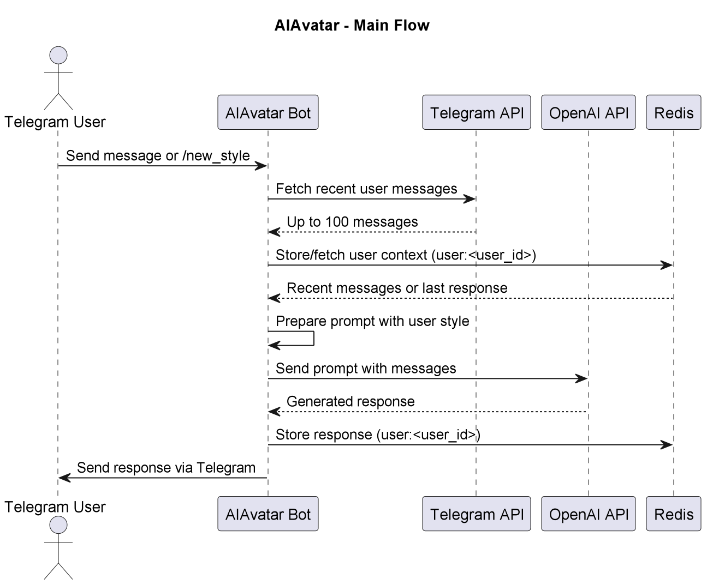

# AIAvatar

## Purpose & Scope
AIAvatar is a Telegram bot that uses the OpenAI API to provide conversational responses, adapting to the user's messaging style by analyzing their recent messages and storing context in Redis.

## Prerequisites
- Python 3.10+
- Telegram API credentials (API_ID and API_HASH from my.telegram.org)
- OpenAI API key for conversational responses
- Redis database for storing user message context
- Dependencies from PyPI (listed in `requirements.txt`)

### Required Environment Variables
- `API_ID` — Telegram API ID
- `API_HASH` — Telegram API Hash
- `OPENAI_API_KEY` — OpenAI API key for accessing the conversational model
- Redis host credentials (used by `RedisDB`)

## Quickstart
1. **Install dependencies:**
   ```bash
   pip install -r requirements.txt
   ```
2. **Set environment variables:**
   ```bash
   export API_ID="your-telegram-api-id"
   export API_HASH="your-telegram-api-hash"
   export OPENAI_API_KEY="your-openai-api-key"
   export REDIS_HOST="your-redis-host"
   export REDIS_PORT="your-redis-port"
   export REDIS_DB="0"
   ```
3. **Run the bot:**
   ```bash
   python ai_avatar/main.py
   ```
4. **Authenticate and interact:**
   - Follow prompts to enter phone number and SMS code (or password if 2FA is enabled).
   - In Telegram, send messages to the bot or use `/new_style` to refresh the user’s messaging style context.

**The bot will:**
- Authenticate with Telegram using Telethon
- Fetch up to 100 recent user messages for style analysis
- Generate responses via OpenAI, adapting to the user’s tone and style
- Store the latest response in Redis for contextual continuity

# Architecture & Flow

## Overview
AI Avatar is a Telegram bot that:
1. Analyzes user's communication style (last 100 messages)
2. Generates personalized responses using OpenAI API
3. Maintains conversation context in Redis

## Component Diagram
See [`ai_avatar_diagram`](images/diagrams/ai_avatar.png) for a high-level sequence diagram, including:

## Flow Description

1. **User sends `/new_style`** via Telegram.
2. The bot:
   - Fetch recent user messages (<=100).
   - Store/fetch user context (user:<user_id>).
   - Prepare prompt with user style.
   - Store response in Redis.
   - Send response via Telegram.

## Data Flow
1. **User Interaction**:
   - Sends regular message or `/new_style` command
   - Receives stylistically-matched responses

2. **Key Features:**

- Style adaptation using message history

- Context preservation between sessions

- Manual style refresh via /new_style

## Error Handling
- Redis failures: Continue without cached context

- OpenAI errors: Return user-friendly message

- Telegram API issues: Retry with exponential backoff

# API & Configuration Reference

## Public Interface

AIAvatar is a Telegram bot and does not expose a traditional REST API. Instead, it provides Telegram commands and message handling to interact with users, leveraging the OpenAI API for responses and Redis for context storage. The primary command is documented below.

### `/new_style`

Refreshes the user’s messaging style context by fetching their last 100 messages from Telegram chats.

#### Parameters

None

**Example:**

```bash
/new_style
```

#### Behavior

- Fetches up to 100 recent messages sent by the user across different Telegram chats.
- Stores the messages in Redis under the user’s ID for style analysis.
- Responds with a confirmation message or an error if the operation fails.

#### Response

Returns a Telegram message confirming success or reporting an error.

**Example Response:**

```markdown
Context successfully updated!
```

### Message Handling

Handles any incoming user message (excluding commands) by generating a conversational response.

#### Parameters

- User message (free-form text sent to the bot)

**Example:**

```bash
Hey, what's up? Can you help me with some Python tips?
```

#### Behavior

- Retrieves up to 100 recent user messages for style analysis.
- Loads the last bot response from Redis (if available) for context.
- Sends a prompt to the OpenAI API, including the user’s recent messages, the last bot response, and the current message.
- Generates a response matching the user’s tone and style.
- Stores the response in Redis for future context.
- Sends the response to the user via Telegram.

#### Response

Returns a Telegram message with a conversational response or an error message if processing fails.

**Example Response:**

```markdown
Yo, what's good? Sure thing, I can drop some Python tips! Want help with a specific topic, like loops or async stuff?
```

---

## Configuration Reference

### Redis Keys

- `user:<user_id>` — Stores the user’s recent messages and last bot response for context.

### Required Environment Variables

| Variable             | Description                                      |
|---------------------|--------------------------------------------------|
| `API_ID`            | Telegram API ID from my.telegram.org             |
| `API_HASH`          | Telegram API Hash from my.telegram.org          |
| `OPENAI_API_KEY`    | OpenAI API key for conversational responses     |
| `REDIS_HOST`        | Redis host address                              |
| `REDIS_PORT`        | Redis port (e.g., 6379)                         |
| `REDIS_DB`          | Redis database index (e.g., 0)                  |

### Configuration Example

```bash
export API_ID="your-telegram-api-id"
export API_HASH="your-telegram-api-hash"
export OPENAI_API_KEY="your-openai-api-key"
export REDIS_HOST="localhost"
export REDIS_PORT="6379"
export REDIS_DB="0"
```

# Diagram



# Example workflow
```
#!/bin/bash
# AI Avatar - Basic Interaction Example

# 1. Start conversation
curl -s -X POST \
  -H "Content-Type: application/json" \
  -d '{"chat_id": "USER_CHAT_ID", "text": "Hello"}' \
  https://api.telegram.org/bot$TELEGRAM_BOT_TOKEN/sendMessage

# 2. Expected response format:
# {
#   "ok": true,
#   "result": {
#     "text": "Hi there! *adjusts tone to match your style* How can I help?",
#     "reply_markup": {"remove_keyboard": true}
#   }
# }

# 3. Refresh user style (manual update)
curl -s -X POST \
  -H "Content-Type: application/json" \
  -d '{"chat_id": "USER_CHAT_ID", "text": "/new_style"}' \
  https://api.telegram.org/bot$TELEGRAM_BOT_TOKEN/sendMessage

# Environment variables needed:
# export TELEGRAM_BOT_TOKEN="your_bot_token"
# export OPENAI_API_KEY="your_openai_key"
```