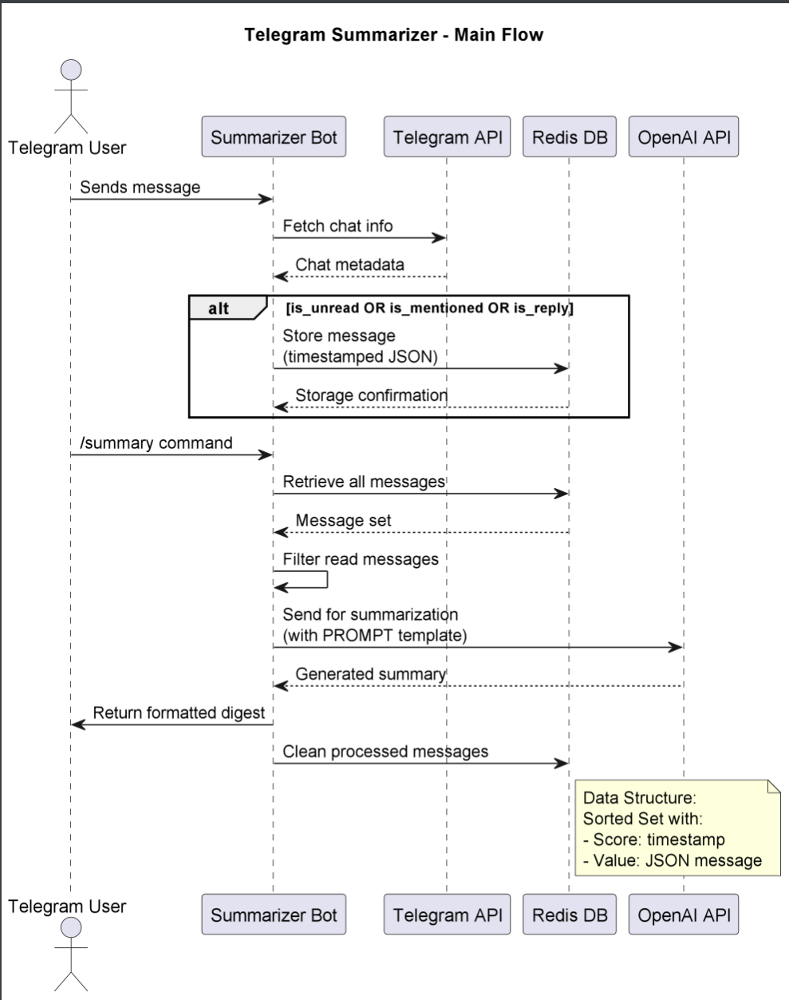

# Telegram Summarizer Agent

## Purpose & Scope
The Telegram Summarizer collects and summarizes unread messages, mentions, and replies across all your Telegram chats. It generates concise daily/weekly digests using OpenAI's API.

## Prerequisites
- Python 3.10+
- Telegram API ID and Hash (from my.telegram.org)
- OpenAI API key
- Redis server for message storage
- Telethon library (`pip install telethon`)

### Required Environment Variables
```bash
export API_ID="your_telegram_api_id"
export API_HASH="your_telegram_api_hash"
export OPENAI_API_KEY="your_openai_key"
```

## Quickstart
1. **Install dependencies:**
```bash
pip install telethon redis openai
```

2. **Run the agent:**
```bash
python telegram_summarizer/main.py
```

3. **First-run setup:**
- Enter your phone number when prompted
- Provide the SMS verification code
- Complete 2FA if enabled

4. **Usage:**
- The bot automatically collects:
  - Unread messages
  - Direct mentions (@username)
  - Message replies
- Generate summaries with:
```bash
/summary
```

## Features
- Smart message filtering (only unread/important messages)
- Multi-chat support (groups, channels, DMs)
- Automatic cleanup of read messages
- Context-aware summarization

# Architecture & Flow

## Overview

The `TelegramSummarizer` is a Telethon-based agent that collects and summarizes unread messages, mentions, and replies across Telegram chats. It stores message context in Redis and generates AI-powered digests via OpenAI's API when triggered by the `/summary` command.

## Component Diagram

See [`ai_dialogue_manager_diagram`](./images/diagrams/ai_dialogue_manager.png) for the high-level flow including:
- Telegram client connection via Telethon
- Redis storage for message persistence
- OpenAI API integration for summarization
- Three key internal handlers: message collector, cleaner, and summarizer

## Flow Description

1. **Message Collection Trigger**:
   - The agent monitors all incoming Telegram messages
   - For each message, it checks:
     ```python
     if (not message.out) and (message.unread or 
         message.mentioned or message.is_reply)
     ```
   - Valid messages are stored in Redis as timestamped JSON objects

2. **Summary Generation**:
   - When user sends `/summary` command:
     - Agent first purges read messages via `clean_read_messages()`
     - Combines remaining messages with metadata:
       ```text
       [Chat Name] @username action: message text
       ```
     - Sends structured prompt to OpenAI with strict summarization rules
     - Returns formatted digest grouped by chat

3. **Data Management**:
   - Redis sorted set ensures chronological ordering
   - Automatic cleanup after summary generation
   - Failed API calls trigger graceful degradation:
     - Redis failures → in-memory fallback
     - OpenAI errors → simplified local summary

## Key Components

| Component | Responsibility |
|-----------|----------------|
| `collect_messages` | Filters and stores relevant messages |
| `clean_read_messages` | Maintains storage hygiene |
| `generate_summary` | Orchestrates AI summarization |
| Redis Client | Persistent message storage |
| Telethon Client | Real-time Telegram interaction |

## Behavioral Notes
- Introduces 2-5 second delays during processing to avoid rate limits
- Strictly avoids message content modification
- Preserves original sender attribution in summaries

# API & Configuration Reference

## Public Commands
### `/summary`
Generates a digest of all collected messages since last cleanup.

**Behavior**:
1. Triggers message cleanup (removes read messages)
2. Combines remaining messages into a prompt
3. Sends to OpenAI with this system prompt:
```text
You are an assistant summarizing messages in a chat...
[Full prompt from PROMPT constant]
```
4. Returns formatted summary

**Response Example**:
```text
📋 Summary:

[Work Chat] @john mentioned: Need help with the Q3 report
[Family Group] @mom replied: Dinner at 7pm tonight
[Project Channel] @alex wrote: Updated the design mockups
```

## Configuration

### Redis Keys
| Key | Format | Description |
|-----|--------|-------------|
| `telegram_messages` | Sorted Set | Stores messages with timestamp as score |

### Environment Variables
| Variable | Required | Example | Description |
|----------|----------|---------|-------------|
| `API_ID` | Yes | `123456` | Telegram API ID from my.telegram.org |
| `API_HASH` | Yes | `a1b2c3...` | Telegram API hash |
| `OPENAI_API_KEY` | Yes | `sk-...` | OpenAI API key |

### Constants (in code)
| Name | Default | Description |
|------|---------|-------------|
| `SESSION_NAME` | `"my_telegram_session"` | Telethon session filename |
| `REDIS_MESSAGES_KEY` | `"telegram_messages"` | Redis storage key |
| `BOT_COMMAND` | `"/summary"` | Trigger command |

## Data Structures
**Message Storage Format** (JSON in Redis):
```json
{
  "id": "message_id",
  "text": "message content",
  "sender_username": "@username",
  "action": "wrote|mentioned|replied",
  "chat_name": "Chat Title",
  "chat_id": 123456789,
  "timestamp": 1620000000.0
}
```

## Error Handling
- Failed API calls will return user-friendly messages
- Redis errors trigger fallback to memory storage
- Telegram auth failures provide step-by-step recovery

# Diagram



# Example workflow
```
#!/bin/bash
# Telegram Summarizer - End-to-End Example

# 1. Launch the agent (in background)
python telegram_summarizer/main.py &

# 2. Simulate receiving messages (via Telegram API)
curl -s -X POST \
  -H "Content-Type: application/json" \
  -d '{
    "chat_id": "YOUR_CHAT_ID",
    "text": "Test message for summarization",
    "unread": true
  }' \
  https://api.telegram.org/bot$TELEGRAM_BOT_TOKEN/sendMessage

# 3. Trigger summary generation
curl -s -X POST \
  -H "Content-Type: application/json" \
  -d '{
    "chat_id": "YOUR_CHAT_ID",
    "text": "/summary"
  }' \
  https://api.telegram.org/bot$TELEGRAM_BOT_TOKEN/sendMessage

# Expected Output Example:
# {
#   "ok": true,
#   "result": {
#     "text": "📋 Summary:\n\n[Test Chat] @user1 mentioned: Need help with project\n[Work Group] @boss replied: Deadline extended",
#     "parse_mode": "Markdown"
#   }
# }

# Environment Variables Required:
# export TELEGRAM_BOT_TOKEN="your_bot_token"
# export API_ID="your_telegram_api_id"
# export API_HASH="your_telegram_api_hash"
# export OPENAI_API_KEY="your_openai_key"
```