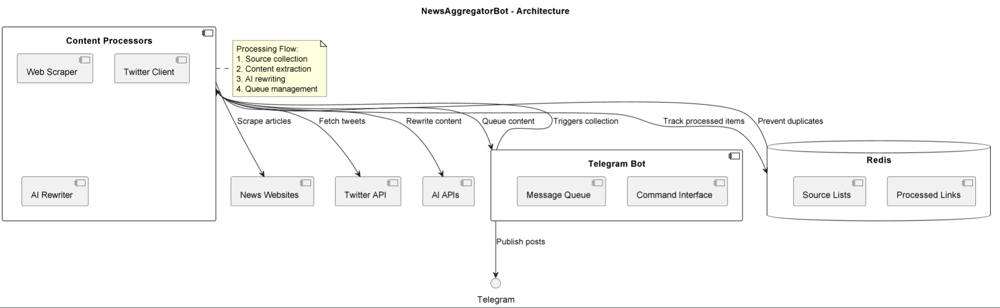

# NewsAggregatorBot

## Purpose & Scope
NewsAggregatorBot is an AI-powered content aggregation and publishing system that:
- Monitors news websites for cryptocurrency articles
- Tracks Twitter accounts for relevant tweets
- Processes content through AI for summarization/rewriting
- Publishes formatted posts to Telegram channels

## Prerequisites
- Python 3.10+
- Redis server
- Telegram bot token
- Twitter API v2 access
- OpenAI/Grok API access
- Dependencies from PyPI (listed in `requirements.txt`)

### Required Environment Variables
- `TELEGRAM_BOT_TOKEN` - Telegram bot authentication
- `TELEGRAM_CHANNEL_ID` - Target channel ID
- `TWITTER_BEARER_TOKEN` - Twitter API v2 bearer token
- `GROK_API_KEY` - xAI Grok API key
- `REDIS_URL` - Redis connection string

## Quickstart
1. **Install dependencies:**
   ```bash
   pip install -r requirements.txt
   ```

2. **Configure environment:**
   ```bash
   export TELEGRAM_BOT_TOKEN="your_token"
   export TWITTER_BEARER_TOKEN="your_twitter_token"
   ```

3. **Run the bot:**
   ```bash
   python news_aggregator_bot.py
   ```

4. **Add sources:**
   ```
   /add_links https://cointelegraph.com
   /add_x_account elonmusk
   ```

**Key Features:**
- Multi-source aggregation
- AI content processing
- Rate-limited publishing
- Duplicate prevention

# Architecture & Flow

## Overview
NewsAggregatorBot implements a content pipeline with:

1. **Collection Layer**:
   - Website scraping (BeautifulSoup)
   - Twitter API integration
   - Grok AI search

2. **Processing Layer**:
   - HTML content extraction
   - AI-powered rewriting
   - Markdown formatting

3. **Delivery Layer**:
   - Rate-limited Telegram publishing
   - Message queue management
   - Error handling

## Component Diagram
See [`ai_smm_manager_diagram`](./images/diagrams/ai_smm_manager.png) for the high-level flow including:
- Telegram interaction points
- Content sources
- Processing components
- Data storage

## Content Flow
1. Periodic source checks (10s interval)
2. New content detection
3. AI processing (OpenAI/Grok)
4. Queue management
5. Scheduled publishing

# API & Configuration Reference

## Telegram Commands

### `/add_links <url1> <url2>...`
Adds news websites to monitor

### `/add_x_account <handle1> <handle2>...`
Adds Twitter accounts to track

### `/find_in_grok <query>`
Searches Grok AI for tweets

## Configuration

### Environment Variables
| Variable | Description |
|----------|-------------|
| `TELEGRAM_*` | Bot configuration |
| `TWITTER_*` | API v2 credentials |
| `GROK_API_*` | xAI integration |
| `REDIS_URL` | Cache server |

### Redis Keys
| Key | Purpose |
|-----|---------|
| `processed_articles` | Tracked URLs |
| `news_sites` | Monitored websites |
| `twitter_accounts` | Tracked handles |
| `processed_tweets` | Published tweets |

### Rate Limits
| Operation | Interval |
|-----------|---------|
| Telegram posts | 30s |
| Source checks | 10s |
| API retries | 5 attempts |

# Diagram



# Example workflow
```
#!/bin/bash
# NewsAggregatorBot - Usage Examples

# 1. Add news sources
curl -X POST "http://localhost:8000/add_links" \
  -H "Content-Type: application/json" \
  -d '["https://cointelegraph.com", "https://decrypt.co"]'

# 2. Add Twitter accounts
curl -X POST "http://localhost:8000/add_x_account" \
  -H "Content-Type: application/json" \
  -d '["elonmusk", "cz_binance"]'

# 3. Sample AI-processed output
echo "Sample Telegram Post:"
echo "🚀 **Major Bitcoin Rally**"
echo ""
echo "BTC surged 15% today amid ETF approval rumors..."
echo ""
echo "*Key points:*"
echo "- ETF decision expected Friday"
echo "- Institutional inflows up 300%"
echo "- Resistance at 45K"
echo ""
echo "#Bitcoin #Crypto #ETF"
```