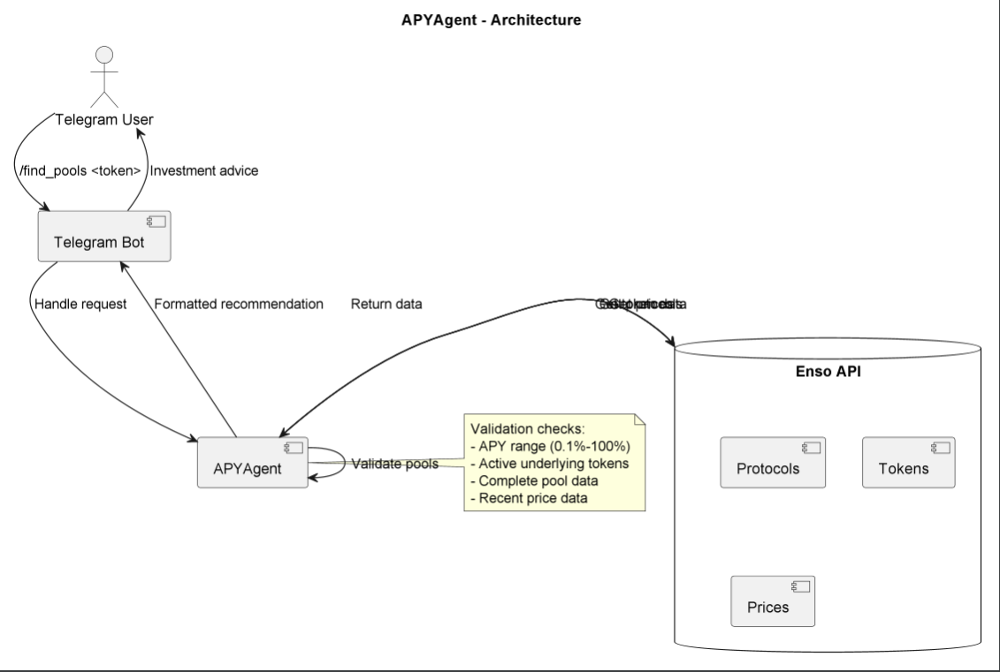

# APYAgent

## Purpose & Scope
APYAgent is a Telegram bot that analyzes DeFi investment opportunities by:
- Finding secure liquidity pools for specified tokens
- Validating pool safety parameters
- Recommending optimal investment options
- Providing detailed pool analytics

## Prerequisites
- Python 3.10+
- Telegram Bot Token
- Enso Finance API access
- Redis (optional for caching)
- Dependencies from PyPI (listed in `requirements.txt`)

### Required Environment Variables
- `TELEGRAM_BOT_TOKEN` - Bot authentication token
- `ENSO_API_KEY` - Enso Finance API key
- `BASE_URL` - Enso API base URL (default: "https://api.enso.finance")

## Quickstart
1. **Install dependencies:**
   ```bash
   pip install -r requirements.txt
   ```

2. **Set environment variables:**
   ```bash
   export TELEGRAM_BOT_TOKEN="your_bot_token"
   export ENSO_API_KEY="your_enso_key"
   ```

3. **Run the agent:**
   ```bash
   serve run apy_agent:app
   ```

4. **Interact via Telegram:**
   ```
   /find_pools 0xA0b86991c6218b36c1d19D4a2e9Eb0cE3606eB48
   ```

**Key Features:**
- Multi-protocol analysis
- Pool safety validation
- APY-based ranking
- Detailed token analytics

# Architecture & Flow

## Overview
APYAgent combines Telegram bot interface with DeFi analytics:

1. **User Interaction**:
   - Telegram command parsing
   - Status updates
   - Markdown-formatted results

2. **Data Processing**:
   - Multi-protocol analysis
   - Token price validation
   - APY-based ranking

3. **Safety Checks**:
   - APY validation
   - Token activity
   - Data completeness
   - Timeliness checks

## Component Diagram
See [`apy_agent_diagram`](./images/diagram/apy_agent.png) showing:
- Telegram user flow
- Enso API integration
- Data validation process
- Recommendation generation

## Analysis Process
1. Protocol discovery
2. Token scanning
3. Pool validation
4. Top-5 ranking
5. Recommendation formatting

# API & Configuration Reference

## Telegram Commands

### `/find_pools <token_address>`
Finds investment pools for specified ERC-20 token

#### Parameters
- `token_address`: Valid Ethereum token address (e.g., USDC: `0xA0b86991c6218b36c1d19D4a2e9Eb0cE3606eB48`)

#### Responses
Returns Markdown-formatted message with:
- Best pool recommendation
- Top 5 alternatives
- Token price information
- Safety indicators

## Configuration

### Environment Variables
| Variable | Description |
|----------|-------------|
| `TELEGRAM_BOT_TOKEN` | BotFather token |
| `ENSO_API_KEY` | Enso Finance API key |
| `BASE_URL` | Enso API endpoint |

### Safety Thresholds
| Parameter | Value |
|-----------|-------|
| Min APY | 0.1% |
| Max APY | 100% |
| Price Data Age | <24h |
| Min Tokens | 2 |

# Diagram


# Example workflow
```
#!/bin/bash
# APYAgent - Usage Examples

# 1. Find pools for USDC
curl -X POST "http://localhost:8000/find_pools" \
  -H "Content-Type: application/json" \
  -d '{"token_address": "0xA0b86991c6218b36c1d19D4a2e9Eb0cE3606eB48"}'

# 2. Find pools for DAI
curl -X POST "http://localhost:8000/find_pools" \
  -H "Content-Type: application/json" \
  -d '{"token_address": "0x6B175474E89094C44Da98b954EedeAC495271d0F"}'

# 3. Telegram command example
echo "Simulating Telegram command:"
echo "/find_pools 0xA0b86991c6218b36c1d19D4a2e9Eb0cE3606eB48"

# Expected output format:
# 🏆 Found pools for USDC:
# • ProtocolA:
#   - APY: 5.2%
#   - Type: lending
#   - Contract: 0x...
#
# 💰 Token prices:
#    - USDC: $1.00
#    - ETH: $3,500.00```
