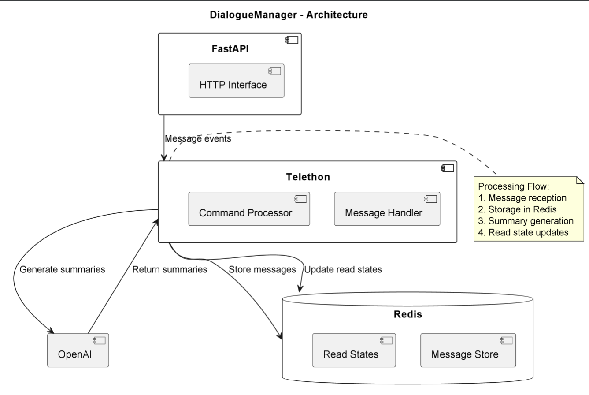

# DialogueManager

## Purpose & Scope
DialogueManager is a conversation processing system that:
- Monitors and processes messages from Telegram chats
- Generates AI-powered summaries of conversations
- Tracks read/unread messages
- Provides command-based interaction (/summary)

## Prerequisites
- Python 3.10+
- Ray framework
- Redis server
- Telegram API access (Telethon)
- OpenAI API access
- Dependencies from PyPI (listed in `requirements.txt`)

### Required Environment Variables
- `TELEGRAM_API_ID` - Telegram API ID
- `TELEGRAM_API_HASH` - Telegram API hash
- `OPENAI_API_KEY` - OpenAI API key
- `REDIS_URL` - Redis connection string

## Quickstart
1. **Install dependencies:**
   ```bash
   pip install -r requirements.txt
   ```

2. **Configure environment:**
   ```bash
   export TELEGRAM_API_ID="your_api_id"
   export TELEGRAM_API_HASH="your_api_hash"
   ```

3. **Run the manager:**
   ```bash
   serve run dialogue_manager:app
   ```

4. **Interact via Telegram:**
   ```
   /summary - Generate conversation summary
   ```

**Key Features:**
- Real-time message processing
- Context-aware summarization
- Read state tracking
- Command-based interaction

# Architecture & Flow

## Overview
DialogueManager implements a conversation processing pipeline with:

1. **Collection Layer**:
   - Telegram message monitoring (Telethon)
   - Command processing (/summary)
   - Message metadata extraction

2. **Storage Layer**:
   - Redis-backed message storage
   - Sorted sets for chronological ordering
   - Read state tracking

3. **Processing Layer**:
   - AI-powered summarization
   - Context-aware processing
   - Error handling

## Component Diagram
See [`dialogue_manager_diagram`](images/diagrams/dialogue_manager_diagram.png) for a high-level peer registration and discovery flow.
- FastAPI interface
- Telethon integration
- Redis data management
- OpenAI processing

## Message Flow
1. Telegram message received
2. Metadata extraction
3. Redis storage
4. AI processing on demand
5. Summary delivery

# API & Configuration Reference

## Core Components

### `DialogueManager` Class
- `handle()` - Main entry point
- `process_message()` - Stores messages
- `update_read_messages()` - Tracks read states
- `generate_summary()` - Creates AI summaries

### Telegram Commands
| Command | Description |
|---------|-------------|
| `/summary` | Generate conversation summary |

## Configuration

### Environment Variables
| Variable | Description |
|----------|-------------|
| `TELEGRAM_*` | API credentials |
| `OPENAI_API_KEY` | AI processing |
| `REDIS_URL` | Storage backend |

### Redis Keys
| Key | Purpose |
|-----|---------|
| `dialogue:messages` | Message storage |
| `dialogue:read_states` | Read tracking |

### AI Prompt
Customizable prompt in `AI_PROMPT` for controlling summary style and content focus.

# Diagram


# Example workflow

```python
import asyncio
from dialogue_manager.main import DialogueManager


async def main():
    manager = DialogueManager()

    sample_msg = {
        "id": "123",
        "text": "Hello world",
        "sender_username": "@testuser",
        "action": "wrote",
        "chat_name": "Test Chat",
        "chat_id": 456,
        "timestamp": 1234567890
    }
    await manager.process_message(sample_msg)

    summary = await manager.generate_summary()
    print(f"Summary: {summary}")


asyncio.run(main())
```