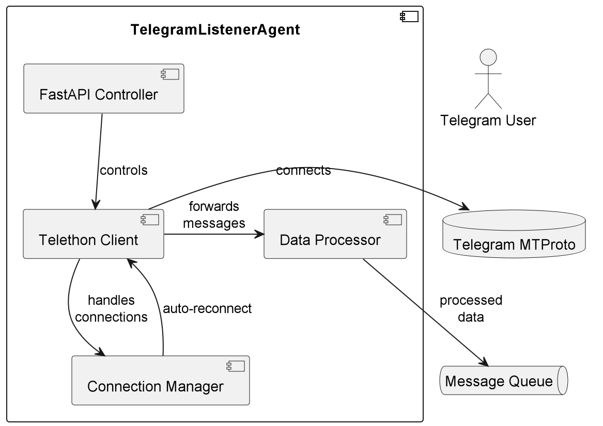

# TelegramListenerAgent

## Purpose & Scope
TelegramListenerAgent monitors specified Telegram channels for new messages and processes them through a data pipeline. It provides real-time message listening with automatic reconnection capabilities.

## Prerequisites
- Python 3.10+
- Telethon library
- FastAPI
- Ray Serve
- Stable internet connection

### Required Environment Variables
- `TELEGRAM_PHONE_NUMBER` - Your Telegram account phone number
- `TARGET_CHAT_ID` - ID of the Telegram chat/channel to monitor

## Quickstart
1. **Install dependencies:**
   ```bash
   pip install telethon fastapi ray[serve] python-dotenv
   ```

2. **Set environment variables:**
   ```bash
   export TELEGRAM_PHONE_NUMBER="your_phone_number"
   export TARGET_CHAT_ID="target_chat_id"
   ```

3. **Run the agent:**
   ```bash
   ray start --head
   python -m telegram_listener_agent
   ```

4. **Control the agent:**
   ```bash
   # Start listening
   curl -X POST http://localhost:8000/control/start

   # Check status
   curl http://localhost:8000/control/status

   # Stop listening
   curl -X POST http://localhost:8000/control/stop
   ```

**The agent will:**
- Connect to Telegram servers
- Listen for new messages in specified chat
- Process messages through data pipeline
- Handle connection drops automatically
- Provide status via REST API

# Architecture & Flow

## Overview
TelegramListenerAgent is a Ray Serve deployment that monitors Telegram channels using Telethon library. It provides real-time message processing with automatic reconnection capabilities through a FastAPI control interface.

## Component Diagram
See [`telegram_listener_agent_diagram`](./images/diagrams/telegram_listener_agent.png) showing:

- Telegram MTProto server connection
- FastAPI control plane
- Telethon client management
- Message processing pipeline
- Automatic reconnection handler

## Flow Description

### Startup Sequence
1. **Initialization**:
   - FastAPI app starts with lifespan manager
   - Data processing backend initializes
   - Telethon client manager prepares session

2. **Connection Establishment**:
   - Client connects to Telegram MTProto servers
   - User authorization verified (may require 2FA)
   - Event handler registered for target chat

### Message Processing Flow
1. **Event Reception**:
   - NewMessage event triggers handler
   - Message metadata validated
   - Chat ID filtered against target

2. **Data Processing**:
   ```plaintext
   Raw Message → Parser → Validator → Transformer → Output
   ```
   - Content extraction
   - Media handling (if present)
   - Metadata enrichment

3. **Downstream Delivery**:
   - Processed messages queued
   - Error isolation per message
   - Retry logic for transient failures

### Connection Management
- **Automatic Reconnect**:
  - 5-second heartbeat check
  - Exponential backoff (15s → 60s)
  - Handler re-registration

- **Error Handling**:
  - Flood wait detection (auto-pause)
  - Permission error escalation
  - Auth failures (session invalidation)

# API & Configuration Reference

## REST API Endpoints

### POST `/control/start`
Initiates message listening on the specified Telegram channel.

**Response:**
- `202 Accepted`: Listener start requested
- `503 Service Unavailable`: Data processing backend not initialized

**Example:**
```bash
curl -X POST http://localhost:8000/control/start
```

### POST `/control/stop`
Gracefully stops the message listener.

**Response:**
- `202 Accepted`: Listener stop requested

**Example:**
```bash
curl -X POST http://localhost:8000/control/stop
```

### GET `/control/status`
Returns current agent status.

**Response:**
```json
{
  "status": "running|stopping|stopped",
  "client_connected": true|false,
  "phone": "+1234567890",
  "target_chat": "-1001234567890"
}
```

**Example:**
```bash
curl http://localhost:8000/control/status
```

## Configuration Reference

### Environment Variables

| Variable | Required | Description | Example |
|----------|----------|-------------|---------|
| `TELEGRAM_PHONE_NUMBER` | Yes | Telegram account number in international format | `"+1234567890"` |
| `TARGET_CHAT_ID` | Yes | Numeric chat ID or username | `-1001234567890` or `"channelname"` |

### Error Handling
The agent automatically handles:
- Connection drops (auto-reconnect)
- Flood wait restrictions
- Authentication errors
- Permission issues

## Message Processing Flow
1. New message event received
2. Message passed to `process_new_message()`
3. Data validation and transformation
4. Output to configured processing pipeline

# Diagram



# Example workflow

```
#!/bin/bash
# TelegramListenerAgent - Basic Interaction Examples

# 1. Start the listener service
curl -s -X POST \
  http://localhost:8000/control/start

# Expected response:
# {
#   "status": "Listener start requested"
# }

# 2. Check listener status
curl -s \
  http://localhost:8000/control/status

# Expected response format:
# {
#   "status": "running",
#   "client_connected": true,
#   "phone": "+1234567890",
#   "target_chat": "-1001234567890"
# }

# 3. Stop the listener service
curl -s -X POST \
  http://localhost:8000/control/stop

# Expected response:
# {
#   "status": "Listener stop requested"
# }

# 4. Example error case (missing auth)
# Simulate by stopping then checking status
curl -s -X POST http://localhost:8000/control/stop
sleep 2
curl -s http://localhost:8000/control/status

# Expected error state response:
# {
#   "status": "stopped",
#   "client_connected": false,
#   "phone": "+1234567890",
#   "target_chat": "-1001234567890"
# }
```
