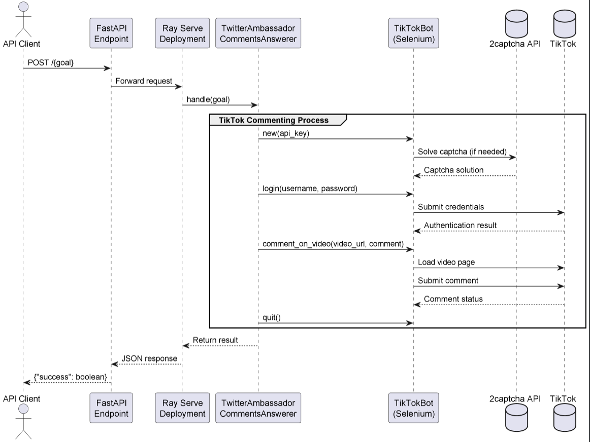

# TikTokTestAgent

## Purpose & Scope
Automates TikTok comment posting through browser automation. Handles:
- Chrome browser installation (Linux)
- TikTok authentication
- Video commenting via Selenium
- Captcha solving using 2captcha service

## Prerequisites
- Linux OS (for automatic Chrome install)
- Python 3.10+
- `google-chrome-stable` package
- Active 2captcha API key
- Valid TikTok account credentials

### Required Permissions
- sudo access for package installation
- Internet access for TikTok and 2captcha

## Quickstart
1. **Install dependencies:**
```bash
pip install fastapi ray[serve] selenium
```

2. **Run the service:**
```bash
python twitter_ambassador_comment_answerer.py
```

3. **Trigger commenting:**
```bash
curl -X POST http://localhost:8000/comment
```

## Configuration
### Hardcoded Parameters (Update before deployment!)
```python
# TikTok credentials
username = "your_tiktok@email.com"
password = "your_password" 

# 2captcha API key 
api_key = "your_2captcha_key"

# Default test video
video_url = "https://www.tiktok.com/@test/video/123"
comment = "Test comment"
```

## Security Notice
- Credentials are currently hardcoded (unsafe for production)
- No input validation on video URLs
- Browser automation may trigger anti-bot systems

# Architecture & Flow

## Overview
The TwitterAmbassadorCommentsAnswerer is a FastAPI service built on Ray Serve that automates TikTok interactions through browser automation. It follows a single-operation flow focused on commenting functionality.

## Component Diagram
See [`tik_tok_agent_diagram`](images/diagrams/tik_tok_agent.png) for a high-level peer registration and discovery flow.

## Core Components
1. **FastAPI Layer**:
   - Provides HTTP interface
   - Handles request routing
   - Manages lifespan

2. **Ray Serve Deployment**:
   - Wraps the agent logic
   - Handles scaling
   - Manages requests queue

3. **TikTokBot Worker**:
   - Browser automation (Selenium)
   - Credential management
   - Comment posting logic
   - Captcha solving integration

4. **System Dependencies**:
   - Chrome browser
   - 2captcha service
   - TikTok platform

## Execution Flow
1. **Initialization**:
   - Chrome installation check
   - WebDriver setup
   - Service dependencies verification

2. **Operation Phase**:
   ```plaintext
   API Request → Authentication → Video Navigation → Comment Posting → Cleanup
   ```

3. **Shutdown**:
   - Browser session termination
   - Resource cleanup
   - Error state handling

## Failure Modes
1. **Browser-Level**:
   - Chrome installation failures
   - Driver compatibility issues

2. **Platform-Level**:
   - TikTok authentication failures
   - Captcha solving timeouts

3. **Operation-Level**:
   - Element not found errors
   - Rate limiting detection
   - Network interruptions

# API Reference

## Endpoints

### POST `/{goal}`
Main endpoint for triggering TikTok comment operations.

#### Parameters
- `goal` (path): Action type (currently only "comment" supported)
- `plan` (body, optional): Additional parameters (not currently used)

#### Example Request
```bash
curl -X POST http://localhost:8000/comment
```

#### Response
Successful response:
```json
{
    "success": true
}
```

Error response:
```json
{
    "success": false,
    "error": "Error message"
}
```

## Execution Flow
1. Installs Chrome (if not present)
2. Initializes TikTokBot with 2captcha API key
3. Logs into TikTok using credentials
4. Posts comment to hardcoded test video
5. Closes browser session

## Configuration Keys
| Parameter | Type | Default | Description |
|-----------|------|---------|-------------|
| `headless` | bool | `False` | Run browser in headless mode |
| `api_key` | str | - | 2captcha service API key |
| `video_url` | str | Test URL | Target TikTok video URL |
| `comment_text` | str | "Hello world!_test_test" | Comment to post |

## Error Handling
Common error scenarios:
- Chrome installation failures
- TikTok login failures
- Captcha solving timeouts
- Invalid video URLs
- Rate limiting from TikTok

# Diagram



# Example workflow

```
#!/bin/bash
# Minimal Example for TwitterAmbassadorCommentsAnswerer

# Input: TikTok video URL and comment text
VIDEO_URL="https://www.tiktok.com/@example_user/video/123456789"
COMMENT_TEXT="This is an automated comment"

# Make API request to the agent
curl -X POST "http://localhost:8000/comment" \
  -H "Content-Type: application/json" \
  -d '{
    "video_url": "'"$VIDEO_URL"'",
    "comment_text": "'"$COMMENT_TEXT"'"
  }'

# Expected Output:
# {"success": true} on successful comment
# {"success": false, "error": "..."} on failure
```