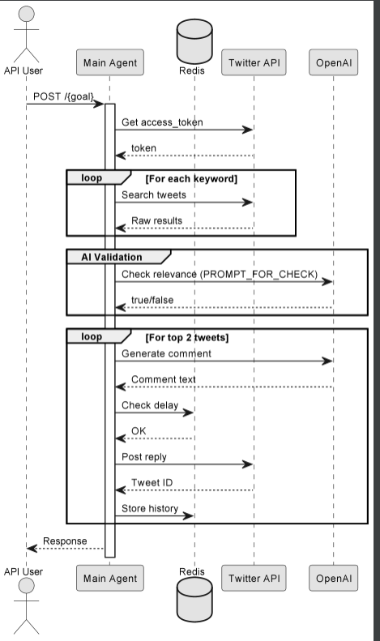

# TwitterGorillaMarketingAgent

## Purpose & Scope
TwitterGorillaMarketingAgent is an autonomous AI agent that:
-  Discovers relevant Twitter discussions about Web3/AI technologies
-  Engages authentically in conversations to promote NFINITY project
-  Automates organic community growth through strategic commenting
- ️ Ensures brand-safe interactions using AI moderation

## Prerequisites

### System Requirements
- Python 3.10+
- Redis server (for tracking commented posts)
- Twitter API v2 access

### API Keys
| Service          | Environment Variable | How to Obtain |
|------------------|----------------------|---------------|
| Twitter API      | Configured via `TwitterAuthClient` | Twitter Developer Portal |
| OpenAI API       | Required for `send_openai_request` | OpenAI Platform |

### Python Dependencies
Key dependencies:
```bash
fastapi==0.95.2
ray[serve]==2.5.1
aiohttp==3.8.4
redis==4.5.5
```

## Quickstart

### 1. Deployment
```python
from ray import serve
from twitter_gorilla_agent import TwitterGorillaMarketingAgent

serve.run(
    TwitterGorillaMarketingAgent.bind(),
    route_prefix="/gorilla-marketing"
)
```

### 2. API Endpoint
```bash
POST /{goal}
```
Where `goal` format is: `username.keywords.themes`  
Example: `nfinityAI.web3,ai.decentralized,autonomous_agents`

### 3. Execution Flow
1. Searches Twitter for target keywords/themes
2. Filters tweets using AI safety checks
3. Posts organic comments on top 2 relevant tweets
4. Tracks engagement in Redis

# Architecture Overview

## Component Diagram

See [`twitter_ambassador_gorilla_marketing_diagram`](images/diagrams/twitter_ambassador_gorilla_marketing.png) for a high-level sequence diagram, including:

### Key Components
1. **Main Agent** 
   - Orchestrates the entire workflow
   - Handles API requests and response formatting
   - Manages rate limiting through Redis

2. **Twitter API Client**
   - Handles authentication (OAuth 2.0)
   - Executes tweet searches (`/2/tweets/search/recent`)
   - Posts replies (`/2/tweets`)

3. **AI Gateway**
   - Validates tweet relevance using `PROMPT_FOR_CHECK`
   - Generates organic comments via `PROMPT_FOR_COMMENT`

4. **Redis Store**
   - Tracks commented tweets (`gorilla_marketing_answered:{username}`)
   - Enforces posting delays (5+ minutes between comments)
   - Stores post history (`user_posts:{username}`)

## Safety Mechanisms
1. **AI Pre-Screening** - All tweets pass through:
   - Relevance check (technical content only)
   - Brand safety filter (no price discussions)
   - Organic tone verification

2. **Rate Limiting**
   - 5+ minute delay between comments
   - Max 2 comments per execution
   - Redis-tracked post history

3. **Blacklisting**
   - Automatic skip of previously answered tweets
   - Exclusion of own account tweets

# API & Configuration Reference

## REST API Endpoints

### `POST /{goal}`
Initiates gorilla marketing campaign for specified goal.

#### URL Parameters
| Parameter | Format | Example | Description |
|-----------|--------|---------|-------------|
| `goal` | `username.keywords.themes` | `nfinityAI.web3,ai.decentralized` | Triple-segment goal string |

#### Goal Structure
1. **Username**: Twitter handle to post from
2. **Keywords**: Comma-separated search terms (e.g., `web3,ai`)
3. **Themes**: Comma-separated discussion topics (e.g., `decentralized,autonomous_agents`)

#### Request Body
```json
{
   "plan": {
      "max_comments": 2,
      "min_likes": 5,
      "delay_between_posts": 300
   }
}
```

## Configuration

### Redis Tracking
```python
# Keys structure:
"gorilla_marketing_answered:{username}"  # Set of commented tweet IDs
"user_posts:{username}"                 # Sorted set of all posts
```

### Rate Limiting
```python
@ensure_delay_between_posts
async def post_comment():
    # Enforces minimum 5 minutes between comments
```

## Response Handling

### Success
```json
{
  "status": "completed",
  "comments_posted": 2,
  "last_tweet_id": "1234567890"
}
```

### Error Cases
```json
{
  "error": "no_relevant_tweets",
  "message": "No tweets matching safety criteria"
}
```

# Diagram



# Example workflow

```
#!/bin/bash
API_BASE="http://localhost:8000/gorilla-marketing"

# 1. Basic campaign with default settings
echo "Starting basic campaign..."
curl -s -X POST \
  -H "Content-Type: application/json" \
  "$API_BASE/cryptodev.defi,web3.crypto,blockchain" | jq

# Expected response:
# {
#   "status": "completed",
#   "account": "cryptodev",
#   "comments_posted": 2,
#   "last_tweet_id": "1784140326827733400"
# }

# 2. Error case (invalid goal format)
echo -e "\nTesting error handling..."
curl -s -X POST \
  -H "Content-Type: application/json" \
  -d '{}' \
  "$API_BASE/invalid_goal_format" | jq

# Environment variables needed:
# export TWITTER_BEARER_TOKEN="your_twitter_token"
# export OPENAI_API_KEY="your_openai_key"
# export REDIS_URL="redis://localhost:6379"
```