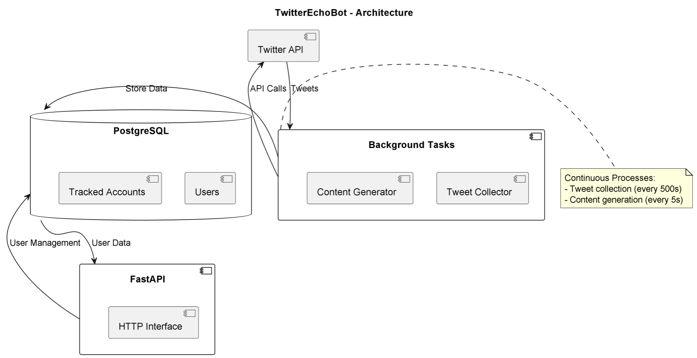

# TwitterEchoBot

## Purpose & Scope
FollowUnfollowBot manages Twitter account tracking and content generation by:
- Collecting tweets from tracked accounts
- Generating persona-based content
- Managing user profiles and preferences
- Automating engagement activities

## Prerequisites
- Python 3.10+
- PostgreSQL database
- Twitter API credentials
- Redis (optional for caching)
- Dependencies from PyPI (listed in `requirements.txt`)

### Required Environment Variables
- `DATABASE_URL` - PostgreSQL connection string
- `TWITTER_API_KEY` - Twitter API key
- `TWITTER_API_SECRET` - Twitter API secret
- `TWITTER_ACCESS_TOKEN` - Twitter access token
- `TWITTER_ACCESS_SECRET` - Twitter access token secret

## Quickstart
1. **Install dependencies:**
   ```bash
   pip install -r requirements.txt
   ```

2. **Initialize database:**
   ```bash
   python -c "from DB.sqlalchemy_database_manager import init_models; asyncio.run(init_models())"
   ```

3. **Run the agent:**
   ```bash
   serve run follow_unfollow_bot:app
   ```

4. **Manage users:**
   ```bash
   # Add new user
   curl -X POST "http://localhost:8000/12345.add_user.johndoe"

   # Update user preferences
   curl -X POST "http://localhost:8000/12345.update_user.johndoe.professional.tech_enthusiast"
   ```

**Key Features:**
- Background tweet collection
- Automated content generation
- User profile management
- Account tracking system


# Architecture & Flow

## Overview
FollowUnfollowBot combines scheduled tasks with API control for Twitter automation:

1. **Core Services**:
   - `TwitterCollectorClient`: Fetches tweets from tracked accounts
   - `CreateTweetsService`: Generates persona-based content
   - User management handlers

2. **Data Layer**:
   - SQLAlchemy-managed PostgreSQL
   - User profiles storage
   - Tracked accounts relationships

3. **Operation Modes**:
   - Background tasks (automatic)
   - API endpoints (manual control)

## Component Diagram
See [`twitter_echo_bot_diagram`](./images/diagrams/twitter_echo_bot.png) for the high-level flow including:
- FastAPI HTTP interface
- Background workers
- Twitter API integration
- Database schema

## Task Scheduling
| Task | Interval | Description |
|------|----------|-------------|
| Tweet Collection | 500s | Fetches new tweets |
| Content Generation | 5s | Creates persona-based posts |


# API & Configuration Reference

## REST Endpoints

#### `POST /{user_id}.{action}.{username}[.additional_params]`
Manages user profiles and tracking

#### Action Types:
| Action | Parameters | Description |
|--------|------------|-------------|
| `add_user` | username | Creates new user |
| `update_user` | username, persona, prompt | Updates preferences |
| `get_user` | - | Retrieves user data |
| `add_handles` | handle1,handle2,... | Adds tracked accounts |

#### Responses
Returns JSON with operation status and user data

## Configuration

### Environment Variables
| Variable | Description |
|----------|-------------|
| `DATABASE_URL` | PostgreSQL connection URL |
| `TWITTER_API_*` | Twitter API credentials |
| `CONTENT_INTERVAL` | Generation frequency (default: 5s) |

### Database Schema
Key tables:
- `users`: User profiles
- `tracked_accounts`: Twitter handles to monitor
- `generated_content`: Created tweets

# Diagram



# Example workflow

```
#!/bin/bash
# FollowUnfollowBot - Usage Examples

# 1. Add new user
curl -X POST "http://localhost:8000/12345.add_user.johndoe"

# 2. Update user persona
curl -X POST "http://localhost:8000/12345.update_user.johndoe.professional.tech_enthusiast"

# 3. Add tracked accounts
curl -X POST "http://localhost:8000/12345.add_handles.johndoe.twitteruser1,twitteruser2"

# 4. Get user data
curl -X POST "http://localhost:8000/12345.get_user.johndoe"

# Example responses:
# {"status":"success","user":{"id":12345,"username":"johndoe"...}}
```