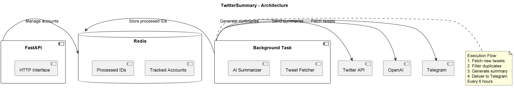

# TwitterSummary

## Purpose & Scope
TweetProcessor automates Twitter content monitoring and summarization by:
- Tracking specified Twitter accounts
- Fetching new tweets periodically
- Generating AI-powered summaries
- Delivering summaries to Telegram channels

## Prerequisites
- Python 3.10+
- Twitter API v2 credentials
- OpenAI API access
- Redis for state management
- Telegram bot token
- Dependencies from PyPI (listed in `requirements.txt`)

### Required Environment Variables
- `TWITTER_BEARER_TOKEN` - Twitter API bearer token
- `OPENAI_API_KEY` - OpenAI API key
- `TELEGRAM_BOT_TOKEN` - Telegram bot token
- `TELEGRAM_CHANNEL_ID` - Target channel ID
- `REDIS_URL` - Redis connection string

## Quickstart
1. **Install dependencies:**
   ```bash
   pip install -r requirements.txt
   ```

2. **Set environment variables:**
   ```bash
   export TWITTER_BEARER_TOKEN="your_twitter_token"
   export OPENAI_API_KEY="your_openai_key"
   export TELEGRAM_BOT_TOKEN="your_telegram_token"
   ```

3. **Run the agent:**
   ```bash
   serve run tweet_processor:app
   ```

4. **Add accounts to monitor:**
   ```bash
   curl -X POST "http://localhost:8000/add_account" \
   -H "Content-Type: application/json" \
   -d '{"account": "twitterhandle"}'
   ```

**Key Features:**
- 6-hour monitoring intervals
- AI-powered summarization
- Duplicate detection
- HTML-formatted Telegram output

# Architecture & Flow

## Overview
TweetProcessor implements a content pipeline with:

1. **Data Collection**:
   - Twitter API v2 integration
   - Account-based tweet fetching
   - Redis-backed duplicate prevention

2. **Processing**:
   - OpenAI-powered summarization
   - HTML content sanitization
   - Batch processing

3. **Delivery**:
   - Telegram channel integration
   - Formatted message output
   - Error-resilient delivery

## Component Diagram
See [`twitter_summary_agent_diagram`](./images/diagrams/twitter_summary_agent.png) for the high-level flow including:
- API management interface
- Background processing flow
- External service integrations
- Data persistence layer

## Content Flow
1. Account discovery (Redis)
2. Tweet collection (Twitter API)
3. Deduplication (Redis)
4. Summarization (OpenAI)
5. Delivery (Telegram)

# API & Configuration Reference

## REST Endpoints

### `POST /add_account`
Adds Twitter account to monitoring list

#### Request Body
```json
{"account": "twitterhandle"}
```

#### Responses
- Success: `{"status": "success"}`
- Error: `{"status": "error", "message": "..."}`

## Configuration

### Environment Variables
| Variable | Description |
|----------|-------------|
| `TWITTER_BEARER_TOKEN` | Twitter API v2 bearer token |
| `OPENAI_API_KEY` | OpenAI API key |
| `TELEGRAM_*` | Telegram integration keys |
| `REDIS_URL` | Redis server URL |

### Monitoring Parameters
| Parameter | Value |
|-----------|-------|
| Scan Interval | 6 hours |
| Max Tweets | All new since last scan |
| Summary Style | Concise, bullet-pointed |

# Diagram



# Example workflow

```
#!/bin/bash
# TweetProcessor - Usage Examples

# 1. Add account to monitor
curl -X POST "http://localhost:8000/add_account" \
  -H "Content-Type: application/json" \
  -d '{"account": "elonmusk"}'

# 2. Example Telegram output format
echo "Sample Telegram Output:"
echo "<b>Twitter Summary Report</b>"
echo "<i>Generated: $(date)</i>"
echo ""
echo "🐦 <b>@elonmusk</b>:"
echo "• Discussed new AI initiatives..."
echo "• Announced Tesla updates..."
echo ""
echo "📊 <i>3 tweets analyzed</i>"
```