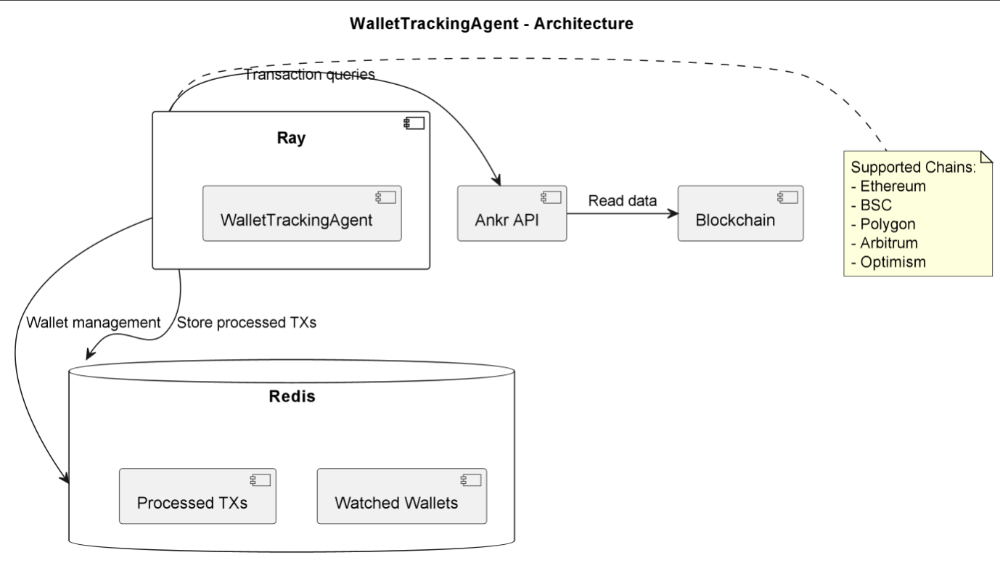

# WalletTrackingAgent

## Purpose & Scope
WalletTrackingAgent monitors blockchain wallets for transactions by:
- Tracking specified wallet addresses across multiple chains
- Detecting buy/sell transactions
- Formatting transaction alerts
- Maintaining processed transaction history

## Prerequisites
- Python 3.10+
- Ray framework
- Redis server
- Ankr RPC API key
- Telegram bot (optional for notifications)
- Dependencies from PyPI (listed in `requirements.txt`)

### Required Environment Variables
- `ANKR_API_KEY` - Ankr RPC API key
- `REDIS_URL` - Redis connection string
- `TELEGRAM_BOT_TOKEN` - Optional for notifications

## Quickstart
1. **Install dependencies:**
   ```bash
   pip install -r requirements.txt
   ```

2. **Initialize Ray:**
   ```bash
   ray start --head
   ```

3. **Run the agent:**
   ```python
   wallet_agent = WalletTrackingAgent.remote()
   ray.get(wallet_agent.process_wallets.remote())
   ```

4. **Manage wallets:**
   ```python
   # Add wallet
   ray.get(wallet_agent.add_wallet.remote("0x..."))

   # Remove wallet
   ray.get(wallet_agent.remove_wallet.remote("0x..."))
   ```

**Key Features:**
- Multi-chain support (Ethereum, BSC, Polygon, etc.)
- Buy/sell detection
- Transaction deduplication
- Rich message formatting

# Architecture & Flow

## Overview
WalletTrackingAgent implements blockchain monitoring with:

1. **Data Collection**:
   - Ankr RPC API integration
   - Multi-chain transaction queries
   - Hex-to-decimal conversion

2. **Processing**:
   - Buy/sell classification
   - Amount normalization (wei to ETH)
   - Duplicate detection

3. **Storage**:
   - Redis-backed wallet tracking
   - Processed transaction cache
   - Set operations for management

## Component Diagram
See [`wallet_tracker_agent_diagram`](images/diagrams/wallet_tracker_agent.png) for a high-level sequence diagram, including:
- Ray distributed execution
- Ankr API integration
- Redis data management
- Multi-chain support

## Transaction Flow
1. Wallet address validation
2. API request to Ankr
3. Response processing
4. Transaction classification
5. Result formatting

# API & Configuration Reference

## Core Methods

### `check_wallet_transactions(wallet_address)`
Fetches transactions for a wallet

### `add_wallet(wallet_address)`
Adds wallet to monitoring list

### `remove_wallet(wallet_address)`
Removes wallet from monitoring

### `process_wallets()`
Main processing loop

## Configuration

### Environment Variables
| Variable | Description |
|----------|-------------|
| `ANKR_API_KEY` | Ankr RPC endpoint key |
| `REDIS_URL` | Redis server URL |

### Redis Keys
| Key | Purpose |
|-----|---------|
| `watched_wallets` | Tracked addresses |
| `processed_transactions:{wallet}` | Processed TX hashes |

### Message Format
```
🟢/🔴 Transaction Alert

🔗 Wallet: 0x...
⛓️ Chain: eth
💱 Action: Buy/Sell
🪙 Token: ETH
📊 Amount: 1.5
💵 Price: $2000

[View TX](explorer_url)
```

# Diagram



# Example workflow

```python
import ray
from wallet_tracker_agent.main import WalletTrackingAgent

ray.init()
wallet_agent = WalletTrackingAgent.remote()

ray.get(wallet_agent.add_wallet.remote("0x742d35Cc6634C0532925a3b844Bc454e4438f44e"))  # Example ETH wallet

results = ray.get(wallet_agent.process_wallets.remote())
for alert in results:
    print(alert["message"])

ray.get(wallet_agent.remove_wallet.remote("0x742d35Cc6634C0532925a3b844Bc454e4438f44e"))
```