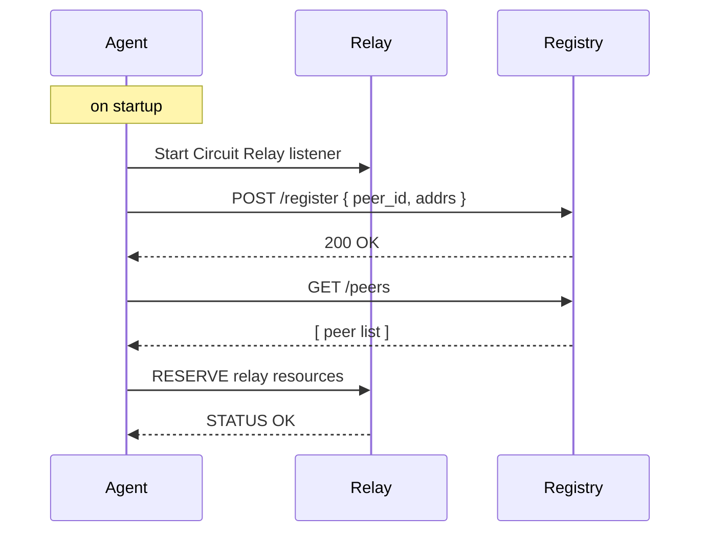

Welcome to Praxis agent architecture that powers our SDK. This document gives you a high-level tour of how agents interact, discover each other, and cooperate to solve complex tasks in a fully decentralized way.

## 1. What Is a Praxis Agent SDK?

In our SDK, each agent is a standalone service that:

- Runs as a FastAPI application inside Ray Serve environment
- Advertises its capabilities (goals, tools, skills)  
- Can delegate work to other agents when needed  

This design lets you compose small, focused services that collaborate—rather than building one huge monolith.

## 2. Core Components

### 2.1 Agents
- Expose HTTP endpoints for direct calls (e.g. `/goal`, `/card`)
- Contain domain logic, memory, and a workflow engine  
- Can install tools on‐demand via [Python entry points](https://packaging.python.org/en/latest/specifications/entry-points/) 

### 2.2 AI Registry
- Central directory where agents register (`POST /register`)  
- Allows agents to discover peers (`GET /peers`)  
- Can be swapped out for a P2P DHT in future  

### 2.3 Relay Service  
- A libp2p Circuit Relay that lets agents behind NAT/firewall connect  
- All traffic is encrypted with Noise/TLS  
- Provides a globally reachable transport without a fixed IP  

### 2.4 Tools & Workflows  
- Tools are defined by a separate python packages
- Workflows are plans (DAGs) of ordered steps invoking tools or peers  
- Praxis workflow orchestration engine handles retries, isolation, and dynamic dependency installs  

## 3. Startup & Discovery

1. **Relay Listen** – agent brings up a libp2p listener  
2. **Register** – agent tells the Registry its peer ID and addresses  
3. **Discover** – agent fetches a list of known peers  
4. **Reserve** – agent ensures the Relay will forward streams to it  

## 4. Agent-to-Agent Handoff

When Agent A lacks a skill, it can:
1. **Lookup** peer info from the Registry  
2. **Open** a libp2p stream via the Relay  
3. **Send** the task payload using a custom protocol  
4. **Receive** the result and continue  

This pattern lets agents share work seamlessly.

## 5. Dynamic Tool Installation

- Workflow steps reference tools by [package entry points](https://packaging.python.org/en/latest/specifications/entry-points/)
- At execution, missing packages are auto-installed in the Ray environment

## 6. Workflow Generation & Execution

1. **Plan** – the agent queries memory, tools, and peers to generate a `Workflow`
2. **Compile** – the `Workflow` is turned into a Ray workflow (DAG)  
3. **Run** – each `WorkflowStep` is invoked in isolation, with retry logic

---

By combining lightweight agents, P2P communication, and on-demand tooling, our decentralized architecture enables resilient, extensible AI systems without a single point of failure. For more details, dive into the [Agents](agents.md), [Knowledge](knowledge.md), and [Orchestration](orchestration.md) guides.