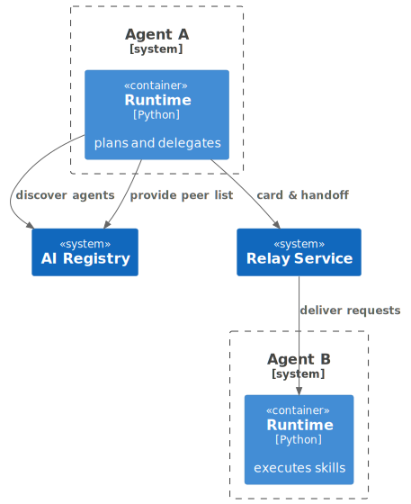
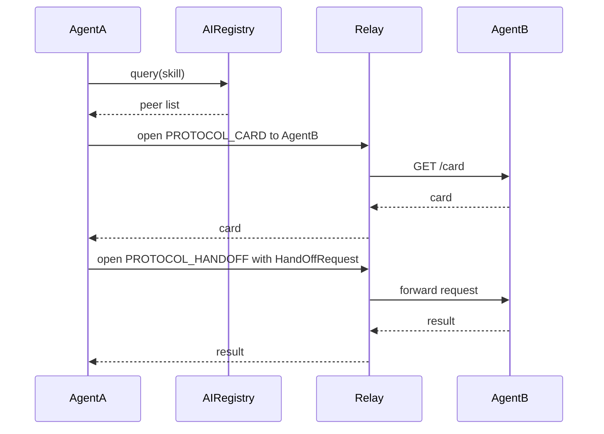

# Decentralized Agent-to-Agent Protocols

This document explains how agents in our SDK communicate peer-to-peer, discover each other's capabilities, and delegate work seamlessly across the network.

## 1. Core Protocols

Our SDK implements two key libp2p protocols for agent communication:

- **Card Protocol** (`/ai-agent/card/1.0.0`) - Exposes agent capabilities
- **Handoff Protocol** (`/ai-agent/handoff/1.0.0`) - Enables task delegation



## 2. Protocol Components

### 2.1 Card Protocol
- Functions like Google's A2A Card system
- Exposes HTTP `/card` endpoint information over libp2p
- Lists available skills with their paths and schemas
- Maps to local HTTP endpoints on the agent

### 2.2 Handoff Protocol  
- Similar to OpenAI's Swarm handoff mechanism
- Enables task delegation between agents
- Uses `HandOffRequest` format for standardized communication
- Maps remote requests to local HTTP endpoints

### 2.3 Request Structure
```python
class HandOffRequest(pydantic.BaseModel):
    method: str  # HTTP method
    path: str    # Endpoint path 
    params: dict = pydantic.Field(default={})  # URL parameters
    input_data: str | None = pydantic.Field(default=None)  # Request body
```

## 3. Discovery & Delegation Flow



The delegation process follows these steps:

1. **Discover** - Query Registry for agents with desired skill
2. **Inspect** - Fetch peer cards via Card Protocol
3. **Select** - Choose most suitable peer based on capabilities
4. **Delegate** - Send task via Handoff Protocol
5. **Complete** - Receive and process results

## 4. Protocol Handlers

### 4.1 Card Protocol Handler
```python
async def handle_card(stream: INetStream) -> None:
    # ... existing code ...
    card_url = f"{cfg.agent_host.url}/card"
    async with httpx.AsyncClient(timeout=2.0) as client:
        response = await client.get(card_url)
        await stream.write(response.content)
```

### 4.2 Handoff Protocol Handler
```python
async def handle_handoff(stream: INetStream) -> None:
    # ... existing code ...
    request_url = f"{base_url}/{formatted_path.lstrip('/')}"
    async with httpx.AsyncClient(timeout=10.0) as client:
        response = await client.request(
            payload.method.upper(), 
            request_url, 
            json=payload.input_data
        )
        await stream.write(response.content)
```

## 5. Benefits

- **Decentralized** - No single point of failure
- **Standardized** - Consistent protocols for all agents
- **Flexible** - Dynamic skill discovery and delegation
- **Secure** - All traffic encrypted via Relay

