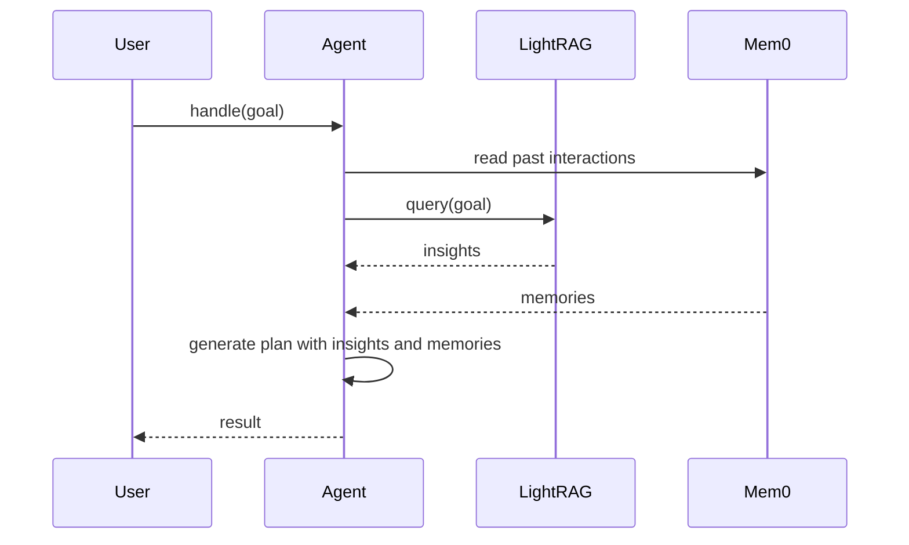

# Knowledge and Memory

Agents rely on two stores of information: a long‑term knowledge graph powered by **LightRAG** and short‑term memories stored in **Mem0**. These systems work together to provide context for planning and conversation.

## LightRAG Knowledge Graph

`LightRAG` maintains a persistent knowledge graph where documents and facts are indexed for retrieval‑augmented generation. The agent interacts with it through the `LightRagClient`.

```python
    def get_relevant_insights(self, goal: str) -> list[InsightModel]:
        """Retrieve relevant insights from LightRAG memory for the given goal."""
        response = self.lightrag_client.post(
            endpoint=self.lightrag_client.endpoints.query,
            json={
                "query": goal,
                "mode": "naive",
            },
        )
        texts = response.get("texts", [])
        return [InsightModel(domain_knowledge=text["text"]) for text in texts if "text" in text]
```
The client sends a query to the knowledge base and returns `InsightModel` objects for use during plan generation.

## Mem0 Interaction Memory

During every interaction the agent writes chat history and workflow results to Mem0 using the `MemoryClient`.

```python
    def store(self, key: str, interaction: list[Any]) -> None:
        try:
            logger.info(f"Storing interaction: {interaction} key: {key}")
            self.memory.add(interaction, run_id=key)
        except Exception as e:
            logger.error(f"Error storing interaction in Mem0: {e}")

    def read(self, key: str, limit: int = 10) -> list[dict[str, Any]]:
        try:
            logger.info(f"Fetching all memories for key: {key}")
            return self.memory.get_all(run_id=key, limit=limit)
        except Exception as e:
            logger.error(f"Error retrieving interactions from Mem0: {e}")
            return []
```

These short‑term memories provide recent context for chat and planning.

## Retrieval Sequence

The diagram below shows when knowledge and memory are consulted as part of the `handle()` flow:



Long‑term knowledge is fetched from LightRAG before planning while Mem0 supplies recent chat logs. Together they enable agents to reason over both persistent facts and the latest conversation history.
