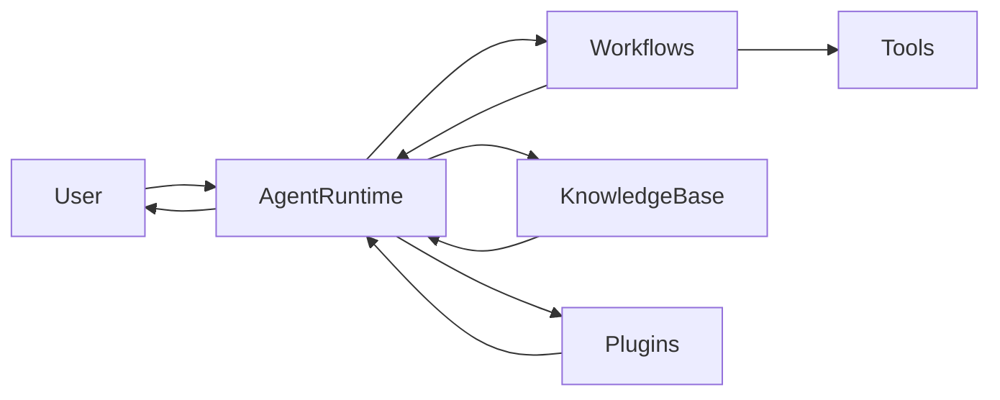

# Overview

Welcome to the Praxis SDK documentation. This project provides the building blocks for running autonomous agents with persistent memory and decentralized communication.

## System Architecture

Praxis agents use a modular layout that keeps core runtime logic separate from integrations and tools:

- **Agent Runtime** – Executes workflows with Ray Serve and manages state.
- **Tools** – Encapsulate capabilities that an agent can perform.
- **Workflows**  – Define the agent's skills that can be executed in background mode.
- **Knowledge base** – Stores long‑term memories and knowledge via vector search.
- **Plugins** – Extend the agent with your own code, skills, and execution engines.

## How It Works

1. **Task Reception** – An agent on HTTP endpoint receives a user goal.
2. **Runtime Processing** – The runtime builds context and selects tools and agents to communicate.
3. **Action Execution** – Selected tools run in isolated Ray workflows; missing packages are installed dynamically.
4. **Learning** – Agent analyze results and store new memories.
5. **Response Delivery** – The runtime replies to the user and may delegate tasks to other agents via libp2p.

This continuous loop lets agents refine their behavior while collaborating in a decentralized network.

## Core Components

| Component | Description |
|-----------|-------------|
| **Agent Runtime** | Coordinates plan generation, chat, and workflow execution. |
| **Knowledge base** | Persists memory and knowledge using vector search using LightRAG. |
| **Tools** | Executable abilities, from calling APIs to handing off tasks. |
| **Knowledge** | Retrieval‑augmented documents for richer responses. |
| **Plugins** | Add new capabilities or integrate with external systems. |

## Key Concepts

### Orchestration Cycle

Each interaction is a cycle of knowledge, actions, and results. Knowledge is stored in a vector space using LightRAG. Actions are executed by tools that can generate responses, and learn from the interaction. Insights feed back into memory so that future responses improve over time.

### Workflows

Workflows are a sequence of actions that can be executed in parallel or sequentially. They are defined by special DSL and used by agents to solve complex tasks in background mode.

### Memory System

Memories are stored with semantic embeddings to retrieve relevant information based on meaning rather than just recency. This enables cross‑platform continuity without losing context.

## FAQ

### What is the difference between Tools and Workflows?

Workflows are a sequence of actions that can be executed in parallel or sequentially. Tools are single atomic action

### How do agents communicate with each other?

Agents discover peers via the AI Registry and exchange tasks over libp2p streams using a Relay service for NAT traversal.

### How are memories stored?

Memories are saved in a vector database using semantic search so agents can recall relevant facts during conversations.

### How extensible is the system?

The plugin architecture allows you to customize any separate component of the system.
