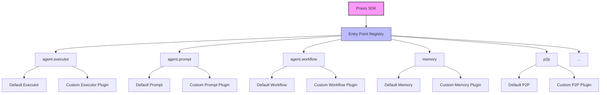

# Plugin System Overview

The Praxis SDK uses a plugin architecture to keep the runtime flexible. Each core component can be swapped by installing a Python package that exposes an [entry point](https://packaging.python.org/en/latest/specifications/entry-points/) under a well known group.

## Architecture Diagram

## Why Entry Points?

Python entry points allow packages to register functions or objects that can be discovered at runtime. The SDK looks up these entry points to load implementations. By following the entry point specification you can package new functionality without changing the core codebase.

## Entry Point Groups

Every pluggable part of the agent runtime defines its own group name in `pyproject.toml`. Important groups include:

- `agent.executor.config` and `agent.executor.entrypoint` – Planning and execution logic.
- `agent.prompt.config` and `agent.prompt.entrypoint` – Prompt templates used to generate goals.
- `agent.workflow.entrypoint` – Workflow runner that turns plans into Ray tasks.
- `memory.entrypoint` – Memory clients for databases or vector stores.
- `p2p.entrypoint` – Peer‑to‑peer networking layer.

Other components like actions, providers and services follow the same pattern. You can inspect the full list in the project's `pyproject.toml` file.

## Creating a Plugin

1. Create a Python package with a `pyproject.toml` declaring the desired entry point group.
2. Implement the callable that builds or returns your component.
3. Install the package so the SDK can discover it via `importlib.metadata`.

Once installed, the runtime will automatically pick up your entry point the next time it loads.

## Extending the Runtime

Because each component is loaded through entry points, you can redesign pieces of the system without modifying the main repository. Custom actions, alternative evaluators or entirely new service adapters can be developed independently and distributed as packages.

For a detailed explanation of the entry point mechanism see the official [Packaging specification](https://packaging.python.org/en/latest/specifications/entry-points/).
