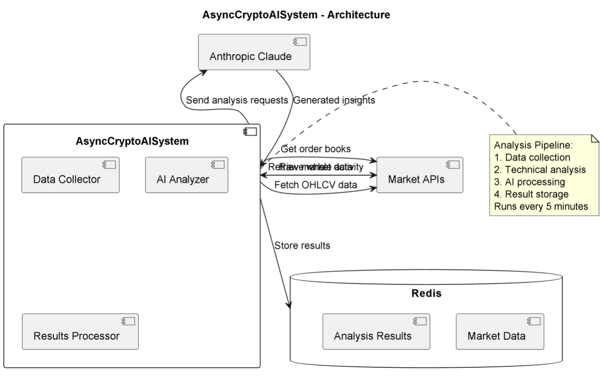

# AsyncCryptoAISystem

## Purpose & Scope
AsyncCryptoAISystem provides comprehensive cryptocurrency market analysis by:
- Collecting real-time market data from multiple sources
- Performing advanced technical analysis
- Generating AI-powered trading insights
- Identifying market structure and key levels
- Detecting whale activity and order flow patterns

## Prerequisites
- Python 3.10+
- Anthropic Claude API access
- Cryptocurrency market data API access
- Redis for caching and state management
- Dependencies from PyPI (listed in `requirements.txt`)

### Required Environment Variables
- `ANTHROPIC_API_KEY` - Anthropic Claude API key
- `REDIS_URL` - Redis connection string
- `MARKET_DATA_API_KEY` - Cryptocurrency data provider key

## Quickstart
1. **Install dependencies:**
   ```bash
   pip install -r requirements.txt
   ```

2. **Set environment variables:**
   ```bash
   export ANTHROPIC_API_KEY="your_claude_key"
   export REDIS_URL="redis://localhost:6379"
   ```

3. **Run the system:**
   ```python
   from async_crypto_ai_system import AsyncCryptoAISystem
   system = AsyncCryptoAISystem("your_claude_key")
   asyncio.run(system.run_analysis())
   ```

**Key Features:**
- Multi-timeframe technical analysis
- AI-generated trade ideas
- Market structure identification
- Risk metric calculation
- Continuous monitoring

# Architecture & Flow

## Overview
AsyncCryptoAISystem implements a complete market analysis pipeline with:

1. **Data Collection Layer**:
   - OHLCV candle data (1h, 4h, 1d)
   - Order book depth
   - Whale transaction tracking
   - Derivatives market data

2. **Analysis Layer**:
   - 20+ technical indicators
   - Market structure detection
   - Divergence analysis
   - Volume profile analysis

3. **AI Integration**:
   - Anthropic Claude processing
   - Trade idea generation
   - Risk assessment
   - Market commentary

## Component Diagram
See [`ai_predicts_manager_diagram`](./images/diagrams/ai_predicts_manager.png) showing:
- Data collection components
- Analysis modules
- AI integration
- Redis caching layer

## Indicator Coverage
| Category | Indicators |
|----------|------------|
| Momentum | RSI, MACD, Stochastic |
| Volatility | ATR, Bollinger Bands |
| Volume | OBV, VWAP, Volume Profile |
| Structure | Pivot Points, Ichimoku, Swing Points |

# API & Configuration Reference

## Core Methods

### `run_analysis(num_coins=5)`
Main analysis loop (continuous operation)

### `analyze_data(market_data)`
Process raw market data through AI

### `integrate_analysis(candles, order_book)`
Comprehensive technical analysis

## Configuration

### Environment Variables
| Variable | Description |
|----------|-------------|
| `ANTHROPIC_API_KEY` | Claude API access |
| `REDIS_URL` | Results caching |
| `MARKET_DATA_*` | Data provider config |

### Analysis Parameters
| Parameter | Default | Description |
|-----------|---------|-------------|
| `num_coins` | 5 | Top coins to analyze |
| `timeframes` | 1h,4h,1d | Analysis periods |
| `interval` | 300s | Analysis frequency |

## Output Format
```json
{
  "trade_alerts": [{
    "symbol": "BTC",
    "type": "long",
    "entry": "42000-42200",
    "targets": ["42500", "43000"],
    "stop": "41800",
    "risk_reward": 2.5,
    "thesis": "Bullish RSI divergence",
    "risk_level": "medium"
  }],
  "market_alpha": {
    "structure": "Bullish higher lows",
    "smart_money": "Accumulating at support",
    "key_levels": {
      "BTC": {
        "support": ["42000", "41500"],
        "resistance": ["42500", "43000"]
      }
    }
  }
}
```

# Diagram



# Example workflow
```python
import asyncio
from ai_predicts_manager.main import AsyncCryptoAISystem


async def main():
    system = AsyncCryptoAISystem("your_claude_key")

    await system.run_analysis(num_coins=3)

    btc_data = await system.data_collector.get_candle_data("BTC", "1h")
    analysis = await system.ai_analyzer.analyze_data([{
        "symbol": "BTC",
        "data": {"1h": btc_data}
    }])
    print(analysis)

asyncio.run(main())
```

