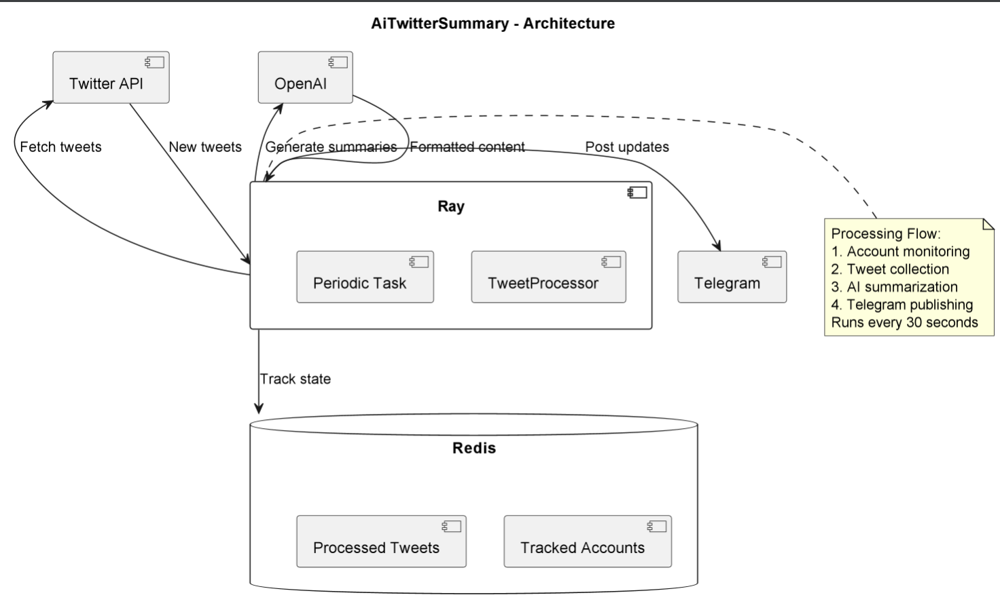

# AiTwitterSummary

## Purpose & Scope
TweetProcessor is an AI-powered Twitter monitoring system that:
- Tracks specified Twitter accounts for new tweets
- Generates concise AI summaries of tweet content
- Publishes formatted summaries to Telegram channels
- Maintains state of processed tweets

## Prerequisites
- Python 3.10+
- Ray framework
- Redis server
- Twitter API v2 access
- OpenAI API access
- Telegram bot token
- Dependencies from PyPI (listed in `requirements.txt`)

### Required Environment Variables
- `TELEGRAM_BOT_TOKEN` - Telegram bot authentication
- `TELEGRAM_CHANNEL_ID` - Target channel ID
- `TWITTER_BEARER_TOKEN` - Twitter API v2 bearer token
- `OPENAI_API_KEY` - OpenAI API key
- `REDIS_URL` - Redis connection string

## Quickstart
1. **Install dependencies:**
   ```bash
   pip install -r requirements.txt
   ```

2. **Initialize Ray:**
   ```bash
   ray start --head
   ```

3. **Run the processor:**
   ```bash
   python tweet_processor.py
   ```

4. **Add accounts to monitor:**
   ```python
   # Add to Redis set
   redis_client.sadd("subscribed_twitter_accounts", "elonmusk")
   ```

**Key Features:**
- Real-time tweet monitoring
- AI-powered summarization
- HTML-formatted Telegram posts
- Duplicate prevention
- Error-resilient operation

# Architecture & Flow

## Overview
TweetProcessor implements a content pipeline with:

1. **Collection Layer**:
   - Twitter API v2 integration
   - Account-based monitoring
   - Rate-limited requests
   - Error handling

2. **Processing Layer**:
   - AI-powered summarization
   - Content sanitization
   - HTML formatting
   - Duplicate detection

3. **Delivery Layer**:
   - Telegram channel integration
   - Formatted message output
   - Error-resilient publishing

## Component Diagram
See [`ai_twitter_summary_diagram`](images/diagrams/ai_twitter_summary.png) for the high-level flow including:
- Ray distributed processing
- Twitter API integration
- OpenAI processing
- Redis state management

## Content Flow
1. Periodic account checks (30s interval)
2. New tweet detection
3. AI summarization
4. Telegram publishing
5. State updates

# API & Configuration Reference

## Core Components

### `TweetProcessor` Class
- `fetch_tweets(account)` - Gets new tweets for an account
- `process_new_tweets()` - Checks all monitored accounts
- `get_redis_set_items(key)` - Helper for Redis access

### Supporting Functions
- `summarize_tweets(tweets)` - Generates AI summaries
- `periodic_task()` - Main processing loop

## Configuration

### Environment Variables
| Variable | Description |
|----------|-------------|
| `TWITTER_BEARER_TOKEN` | API v2 bearer token |
| `TELEGRAM_*` | Bot configuration |
| `OPENAI_API_KEY` | AI processing |
| `REDIS_URL` | State management |

### Redis Keys
| Key | Purpose |
|-----|---------|
| `subscribed_twitter_accounts` | Tracked handles |
| `last_processed_tweets` | Published tweet IDs |

### AI Prompt
Customizable prompt in `AI_PROMPT` constant for controlling summary style and content focus.

# Diagram


# Example workflow
```python
import asyncio
from ai_twitter_summary.main import TweetProcessor, summarize_tweets
from redis_client.main import get_redis_db


async def main():
    processor = TweetProcessor()

    tweets = await processor.process_new_tweets()
    if tweets:
        summary = await summarize_tweets(tweets)
        print(f"Generated Summary:\n{summary}")

    get_redis_db().r.sadd("subscribed_twitter_accounts", "VitalikButerin")

asyncio.run(main())
```
