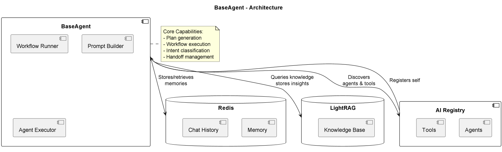

# ExampleAgent

## Purpose & Scope
ExampleAgent serves as a template for creating new agents in the system. It demonstrates the base structure including:
- FastAPI endpoint handling
- Ray Serve deployment patterns
- Workflow execution framework
- Configuration management

## Prerequisites
- Python 3.10+
- Ray Serve environment
- Base agent framework installed
- Dependencies from PyPI (listed in `requirements.txt`)

### Required Environment Variables
- `RAY_ADDRESS` - Ray cluster address (default: "auto")
- `AGENT_CONFIG_PATH` - Path to agent configuration (optional)

## Quickstart
1. **Install dependencies:**
   ```bash
   pip install -r requirements.txt
   ```

2. **Run the agent:**
   ```bash
   python example_agent/main.py
   ```

3. **Make requests:**
   ```bash
   curl -X POST "http://localhost:8000/sample_goal" \
   -H "Content-Type: application/json" \
   -d '{"workflow": {"steps": []}, "context": {}}'
   ```

**The agent provides:**
- Base agent functionality
- Custom workflow execution
- Ray Serve scaling capabilities
- Example sub-agent pattern

# Architecture & Flow

## Overview
BaseAgent implements the core agent pattern with:

1. **Core Components**:
   - Workflow Runner - Executes generated plans
   - Prompt Builder - Constructs LLM prompts
   - Agent Executor - Handles LLM interactions

2. **Memory Systems**:
   - Redis - Short-term memory and chat history
   - LightRAG - Long-term knowledge storage

3. **Coordination**:
   - AI Registry - Agent and tool discovery
   - Handoff protocol - Task delegation

## Component Diagram
See [`base_agent_diagram`](images/diagrams/base_agent.png) for the high-level flow including:
- Core agent components
- External service integrations
- Data flow paths

## Extension Points
1. Override `handle()` for custom logic
2. Implement `reconfigure()` for runtime changes
3. Extend memory systems
4. Customize plan generation

# API & Configuration Reference

## Core Methods

### `handle()`
Main entry point for agent requests

### `chat()`
Handles conversational interactions

### `handoff()`
Delegates tasks to other agents

## Memory Management

### `store_interaction(goal, plan, result, context)`
Saves completed interactions

### `get_past_interactions(goal)`
Retrieves relevant past interactions

### `store_knowledge(filename, content)`
Adds to knowledge base

## Configuration

### Required Services
| Service | Purpose |
|---------|---------|
| Redis | Memory storage |
| LightRAG | Knowledge management |
| AI Registry | Agent discovery |

### Environment Variables
Configured through `BasicAgentConfig`

# Diagram



# Example workflow
```python
from base_agent import BaseAgent
from base_agent.config import BasicAgentConfig
from ray.serve.deployment import Application


class CustomAgent(BaseAgent):
    async def handle(self, goal: str, plan: dict | None = None, context: Any = None):
        if goal == "special_task":
            return await self.handle_special_task(context)
        return await super().handle(goal, plan, context)

    async def handle_special_task(self, context):
        # Custom implementation
        return {"status": "success"}


def agent_builder(args: dict) -> Application:
    return CustomAgent.bind(config=BasicAgentConfig(**args))
```
