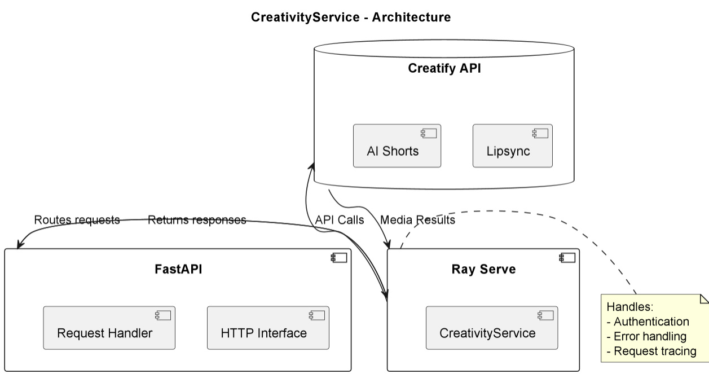

# CreativityService

## Purpose & Scope
CreativityService provides AI-powered media generation capabilities including:
- Lip-sync video generation (v1 and v2)
- AI Short video creation
- Preview generation
- Rendering management

## Prerequisites
- Python 3.10+
- Ray Serve environment
- Creatify API credentials
- Dependencies from PyPI (listed in `requirements.txt`)

### Required Environment Variables
- `CREATIVITY_BASE_URL` - Base URL for Creatify API
- `CREATIVITY_API_ID` - API authentication ID
- `CREATIVITY_API_KEY` - API authentication key
- `LOG_LEVEL` - Logging level (default: "info")

## Quickstart
1. **Install dependencies:**
   ```bash
   pip install -r requirements.txt
   ```

2. **Set environment variables:**
   ```bash
   export CREATIVITY_BASE_URL="https://api.creatify.ai"
   export CREATIVITY_API_ID="your-api-id"
   export CREATIVITY_API_KEY="your-api-key"
   ```

3. **Run the agent:**
   ```bash
   serve run creativity_service:agent_builder
   ```

4. **Generate content:**
   ```bash
   # Create lipsync video
   curl -X POST "http://localhost:8000/lipsyncs/" \
   -H "Content-Type: application/json" \
   -d '{
     "text": "Hello world",
     "avatar_id": "avatar_123",
     "voice_id": "voice_456"
   }'
   ```

**Key Features:**
- Multiple media generation endpoints
- Preview functionality
- Async rendering
- Status tracking

# Architecture & Flow

## Overview
CreativityService acts as a gateway to Creatify's media generation API with:

1. **API Layer**:
   - FastAPI endpoint routing
   - Request validation
   - Response formatting

2. **Service Layer**:
   - HTTP client management
   - Error handling
   - Request tracing

3. **Integration Layer**:
   - Creatify API communication
   - Authentication handling
   - Timeout management

## Component Diagram
See [`creativity_agent_diagram`](images/diagrams/creativity_agent.png) for the high-level flow including:
- Client-facing FastAPI interface
- Ray Serve deployment
- Creatify API integration
- Data flow paths

## Error Handling
- HTTP status code translation
- Detailed error logging
- Request ID tracing

# API & Configuration Reference

## Core Endpoints

### Lipsync v1
| Endpoint | Method | Description |
|----------|--------|-------------|
| `/lipsyncs/` | POST | Create lipsync task |
| `/lipsyncs/preview/` | POST | Generate preview |
| `/lipsyncs/{id}/render/` | POST | Start rendering |
| `/lipsyncs/{id}/` | GET | Get task status |

### Lipsync v2
| Endpoint | Method | Description |
|----------|--------|-------------|
| `/lipsyncs_v2/` | POST | Create task |
| `/lipsyncs_v2/preview/` | POST | Generate preview |
| `/lipsyncs_v2/{id}/render/` | POST | Start rendering |
| `/lipsyncs_v2/{id}/` | GET | Get task status |

### AI Shorts
| Endpoint | Method | Description |
|----------|--------|-------------|
| `/ai_shorts/` | POST | Create short |
| `/ai_shorts/preview/` | POST | Generate preview |
| `/ai_shorts/{id}/render/` | POST | Start rendering |
| `/ai_shorts/{id}/` | GET | Get task status |

## Configuration

### Environment Variables
| Variable | Description |
|----------|-------------|
| `CREATIVITY_BASE_URL` | API base URL |
| `CREATIVITY_API_ID` | Authentication ID |
| `CREATIVITY_API_KEY` | Authentication key |
| `LOG_LEVEL` | Log verbosity |

### Request Models
All endpoints use strongly-typed Pydantic models for:
- Input validation
- Documentation
- Auto-completion

# Diagram



# Example workflow

```
#!/bin/bash
# CreativityService - Usage Examples

# 1. Create lipsync v1
curl -X POST "http://localhost:8000/lipsyncs/" \
  -H "Content-Type: application/json" \
  -d '{
    "text": "Hello world!",
    "avatar_id": "avatar_123",
    "voice_id": "voice_456",
    "response_format": "mp4"
  }'

# 2. Generate AI Short preview
curl -X POST "http://localhost:8000/ai_shorts/preview/" \
  -H "Content-Type: application/json" \
  -d '{
    "avatar_id": "avatar_789",
    "script": "This is an example AI short video script",
    "voice_id": "voice_101"
  }'

# 3. Check task status
curl "http://localhost:8000/lipsyncs_v2/task_123/"

# 4. Health check
curl "http://localhost:8000/_health/"
```