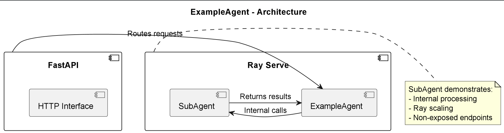

# ExampleAgent

## Purpose & Scope
ExampleAgent serves as a template for creating new agents in the system. It demonstrates the base structure including:
- FastAPI endpoint handling
- Ray Serve deployment patterns
- Workflow execution framework
- Configuration management

## Prerequisites
- Python 3.10+
- Ray Serve environment
- Base agent framework installed
- Dependencies from PyPI (listed in `requirements.txt`)

### Required Environment Variables
- `RAY_ADDRESS` - Ray cluster address (default: "auto")
- `AGENT_CONFIG_PATH` - Path to agent configuration (optional)

## Quickstart
1. **Install dependencies:**
   ```bash
   pip install -r requirements.txt
   ```

2. **Run the agent:**
   ```bash
   python example_agent/main.py
   ```

3. **Make requests:**
   ```bash
   curl -X POST "http://localhost:8000/sample_goal" \
   -H "Content-Type: application/json" \
   -d '{"workflow": {"steps": []}, "context": {}}'
   ```

**The agent provides:**
- Base agent functionality
- Custom workflow execution
- Ray Serve scaling capabilities
- Example sub-agent pattern

# Architecture & Flow

## Overview
ExampleAgent implements the standard agent pattern with:

1. **Public Interface**:
   - FastAPI endpoint at `/{goal}`
   - Workflow execution handler
   - Context-aware processing

2. **Internal Components**:
   - SubAgent for scaled processing
   - Base agent functionality
   - Configuration management

## Component Diagram
See [`example_agent_diagram`](images/diagrams/example_agent.png) showing:
- Public FastAPI interface
- Ray Serve deployment structure
- Internal SubAgent component
- Workflow execution path

## Extension Points
1. Override `handle()` method
2. Add new SubAgents
3. Extend Workflow model
4. Customize bootstrap process

# API & Configuration Reference

## REST Endpoints

### `POST /{goal}`
Executes a workflow for the specified goal.

#### Request Body
```json
{
  "workflow": {
    "steps": [],
    "parameters": {}
  },
  "context": {}
}
```

#### Responses
**Success (200):**
Returns processed workflow results

## Configuration Reference

### Environment Variables
| Variable | Description |
|----------|-------------|
| `RAY_ADDRESS` | Ray cluster address |
| `AGENT_CONFIG_PATH` | Custom config path |

### Bootstrap Process
1. Loads base configuration
2. Initializes Ray Serve
3. Binds agent with config
4. Starts HTTP server


# Diagram



# Example workflow
```
#!/bin/bash
# ExampleAgent - Usage Examples

# 1. Execute simple workflow
curl -X POST "http://localhost:8000/sample_goal" \
  -H "Content-Type: application/json" \
  -d '{
    "workflow": {
      "steps": [
        {"name": "step1", "action": "test"}
      ]
    },
    "context": {"test": true}
  }'

# 2. Check agent status
curl "http://localhost:8000/status"

# 3. Execute empty workflow (testing)
curl -X POST "http://localhost:8000/test" \
  -H "Content-Type: application/json" \
  -d '{"workflow": {"steps": []}}'
```