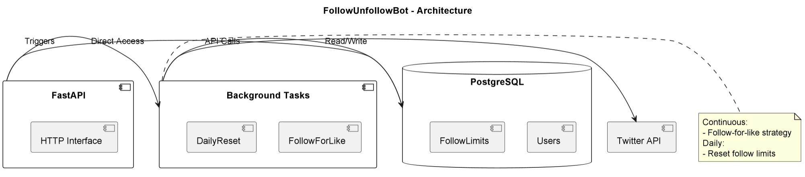

# FollowUnfollowBot

## Purpose & Scope
KolAgent orchestrates coordinated Twitter engagement campaigns ("raids") using multiple bot accounts to amplify messages. It manages authentication, timing, and content distribution across accounts.

## Prerequisites
- Python 3.10+
- Redis instance for account storage
- Twitter API credentials for all bot accounts
- Langfuse account for observability
- Dependencies from PyPI (listed in `requirements.txt`)

### Required Environment Variables
- `REDIS_URL` - Redis connection string
- `TWITTER_CLIENT_ID` - Twitter OAuth2 client ID
- `TWITTER_CLIENT_SECRET` - Twitter OAuth2 client secret
- `LANGFUSE_PUBLIC_KEY` - Langfuse observability key
- `LANGFUSE_SECRET_KEY` - Langfuse secret key
- `LANGFUSE_HOST` - Langfuse server URL

## Quickstart
1. **Install dependencies:**
   ```bash
   pip install -r requirements.txt
   ```

2. **Set environment variables:**
   ```bash
   export REDIS_URL="redis://localhost:6379"
   export TWITTER_CLIENT_ID="your-twitter-client-id"
   export TWITTER_CLIENT_SECRET="your-twitter-client-secret"
   export LANGFUSE_PUBLIC_KEY="your-langfuse-key"
   export LANGFUSE_SECRET_KEY="your-langfuse-secret"
   export LANGFUSE_HOST="https://cloud.langfuse.com"
   ```

3. **Run the agent:**
   ```bash
   serve run kol_agent:app
   ```

4. **Start a raid:**
   ```bash
   curl -X POST "http://localhost:8000/amplify" \
   -H "Content-Type: application/json" \
   -d '{
     "target_tweet_id": "1719810222222222222",
     "tweet_text": "Our revolutionary new product!",
     "bot_accounts": [
       {
         "username": "example_bot1",
         "role": "advocate",
         "account_access_token": "token1",
         "user_id": "12345"
       }
     ],
     "raid_minutes": 0.1
   }'
   ```

# Architecture & Flow

## Overview
FollowUnfollowBot combines scheduled tasks with API control for Twitter growth automation:

1. **Background Processing**:
   - Continuous follow-for-like strategy
   - Daily follow limit resets

2. **Database Layer**:
   - SQLAlchemy-managed PostgreSQL
   - User tracking
   - Daily limits enforcement

3. **API Control**:
   - Add/remove users
   - Manual overrides

## Component Diagram
See [`follow_unfollow_bot_diagram`](images/diagrams/follow_unfollow_bot.png) for a high-level sequence diagram, including:
- FastAPI HTTP interface
- Background task workers
- PostgreSQL data storage
- Twitter API integration

## Task Scheduling
| Task | Frequency | Description |
|------|-----------|-------------|
| `background_task` | Hourly | Executes follow-for-like strategy |
| `daily_task` | Midnight | Resets daily follow counters |

# API & Configuration Reference

## REST Endpoints

### `POST /{twitter_id}.{action}`
Manages user tracking in the system.

#### Path Parameters
- `twitter_id`: Twitter user ID (e.g., `12345`)
- `action`: Either `add` or `delete`

#### Responses
**Success (200):**
```json
{
  "status": "success",
  "action": "added",
  "user_id": 12345
}
```

## Configuration Reference

### Environment Variables
| Variable | Description |
|----------|-------------|
| `DATABASE_URL` | PostgreSQL connection URL |
| `TWITTER_API_*` | Twitter API credentials |
| `DAILY_FOLLOW_LIMIT` | Max follows/day (default: 400) |

### Database Schema
Key tables:
- `users`: Tracked accounts
- `follow_limits`: Daily counters
- `follow_history`: Audit log

# Diagram



# Example workflow

```
#!/bin/bash
# FollowUnfollowBot - Usage Examples

# 1. Add new user to tracking system
curl -X POST "http://localhost:8000/123456789.add"

# Expected response:
# {
#   "status": "success",
#   "action": "added",
#   "user_id": 123456789
# }

# 2. Remove user from system
curl -X POST "http://localhost:8000/987654321.delete"

# 3. Check system status (custom endpoint example)
curl "http://localhost:8000/status"

# 4. Force daily reset (admin endpoint example)
curl -X POST "http://localhost:8000/admin/reset_all"
```
