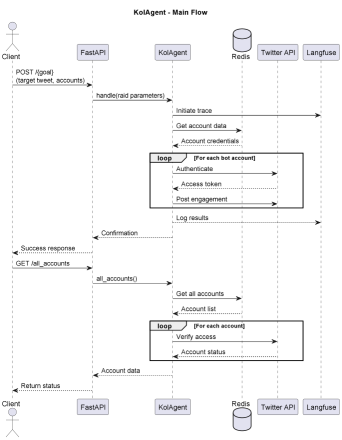

# KolAgent

## Purpose & Scope
KolAgent orchestrates coordinated Twitter engagement campaigns ("raids") using multiple bot accounts to amplify messages. It manages authentication, timing, and content distribution across accounts.

## Prerequisites
- Python 3.10+
- Redis instance for account storage
- Twitter API credentials for all bot accounts
- Langfuse account for observability
- Dependencies from PyPI (listed in `requirements.txt`)

### Required Environment Variables
- `REDIS_URL` - Redis connection string
- `TWITTER_CLIENT_ID` - Twitter OAuth2 client ID
- `TWITTER_CLIENT_SECRET` - Twitter OAuth2 client secret
- `LANGFUSE_PUBLIC_KEY` - Langfuse observability key
- `LANGFUSE_SECRET_KEY` - Langfuse secret key
- `LANGFUSE_HOST` - Langfuse server URL

## Quickstart
1. **Install dependencies:**
   ```bash
   pip install -r requirements.txt
   ```

2. **Set environment variables:**
   ```bash
   export REDIS_URL="redis://localhost:6379"
   export TWITTER_CLIENT_ID="your-twitter-client-id"
   export TWITTER_CLIENT_SECRET="your-twitter-client-secret"
   export LANGFUSE_PUBLIC_KEY="your-langfuse-key"
   export LANGFUSE_SECRET_KEY="your-langfuse-secret"
   export LANGFUSE_HOST="https://cloud.langfuse.com"
   ```

3. **Run the agent:**
   ```bash
   serve run kol_agent:app
   ```

4. **Start a raid:**
   ```bash
   curl -X POST "http://localhost:8000/amplify" \
   -H "Content-Type: application/json" \
   -d '{
     "target_tweet_id": "1719810222222222222",
     "tweet_text": "Our revolutionary new product!",
     "bot_accounts": [
       {
         "username": "example_bot1",
         "role": "advocate",
         "account_access_token": "token1",
         "user_id": "12345"
       }
     ],
     "raid_minutes": 0.1
   }'
   ```

# Architecture & Flow

## Overview
KolAgent coordinates Twitter engagement campaigns through:
1. Redis-stored account management
2. Twitter API authentication workflow
3. Background task execution
4. Langfuse observability integration

## Component Diagram
See [`kol_agent_diagram`](images/diagrams/kol_agent.png) for a high-level sequence diagram, including:
- Client interaction via FastAPI
- Redis for account credential storage
- Twitter API for engagement actions
- Langfuse for execution tracing

## Flow Description
1. **Raid Initialization**:
   - Client POSTs target tweet and bot accounts
   - Agent validates inputs and starts background task
   - Langfuse trace begins

2. **Account Processing**:
   - Retrieves account credentials from Redis
   - Obtains fresh Twitter access tokens
   - Distributes engagement actions

3. **Monitoring**:
   - All actions logged to Langfuse
   - Errors captured and reported
   - Duration controlled by raid_minutes

4. **Account Management**:
   - GET /all_accounts verifies all stored accounts
   - Returns current authentication status
   - Identifies problematic accounts

# API & Configuration Reference

## REST Endpoints

### `POST /{goal}`
Initiates a Twitter engagement campaign.

#### Request Body
```json
{
  "target_tweet_id": "1719810222222222222",
  "tweet_text": "Engagement content",
  "bot_accounts": [
    {
      "username": "account1",
      "role": "advocate",
      "account_access_token": "token123",
      "user_id": "12345"
    }
  ],
  "raid_minutes": 0.1
}
```

#### Responses
**Success (200):**
```json
{
  "success": true,
  "message": "Raid started"
}
```

### `GET /all_accounts`
Lists all configured bot accounts with status.

#### Responses
**Success (200):**
```json
{
  "accounts": [
    {
      "account": "bot1",
      "user_id": "12345",
      "access_token": "token123"
    }
  ],
  "excepted_errors": []
}
```

## Configuration Reference

### Environment Variables
| Variable | Description |
|----------|-------------|
| `REDIS_URL` | Redis connection URL |
| `TWITTER_CLIENT_ID` | Twitter OAuth2 client ID |
| `TWITTER_CLIENT_SECRET` | Twitter OAuth2 client secret |
| `LANGFUSE_*` | Langfuse observability keys |

### Redis Data Structure
- Accounts stored as Redis keys
- Each account requires:
  - Twitter username
  - OAuth2 refresh token
  - Metadata (user_id, etc.)

# Diagram



# Example workflow

```
#!/bin/bash
# KolAgent - Engagement Examples

# 1. Start a quick test raid (0.1 minutes = 6 seconds)
curl -X POST "http://localhost:8000/amplify" \
  -H "Content-Type: application/json" \
  -d '{
    "target_tweet_id": "1719810222222222222",
    "tweet_text": "Check out our revolutionary new AI product! #Innovation",
    "bot_accounts": [
      {
        "username": "tech_bot1",
        "role": "advocate",
        "account_access_token": "token123",
        "user_id": "12345"
      }
    ],
    "raid_minutes": 0.1
  }'

# 2. Check all configured accounts
curl -s "http://localhost:8000/all_accounts" | jq .

# 3. Start multi-account raid
curl -X POST "http://localhost:8000/trending" \
  -H "Content-Type: application/json" \
  -d '{
    "target_tweet_id": "1719810222333333333",
    "tweet_text": "Breaking: Major breakthrough in quantum computing!",
    "bot_accounts": [
      {
        "username": "science_bot1",
        "role": "expert",
        "account_access_token": "token456",
        "user_id": "67890"
      },
      {
        "username": "news_bot2",
        "role": "reporter",
        "account_access_token": "token789",
        "user_id": "13579"
      }
    ],
    "raid_minutes": 5.0
  }'

# Expected error response (invalid token):
# {
#   "success": false,
#   "message": "Failed to authenticate account science_bot1"
# }```