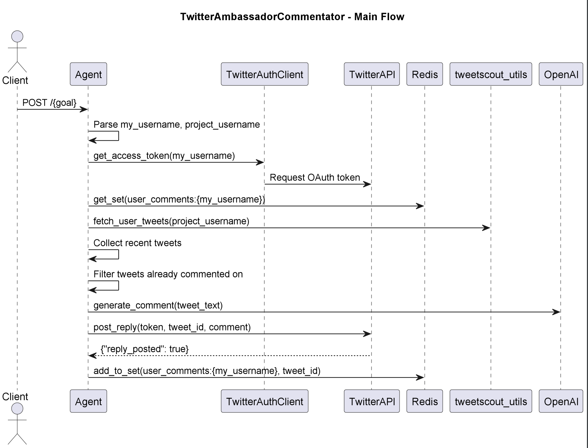

# TwitterCommentatorAgent

## Purpose & Scope

TwitterCommentatorAgent is a Ray Serve microservice that automatically comments on tweets from a specified Twitter user. It acts as an AI-powered Twitter ambassador, creating positive, natural, and concise comments to engage the community and promote projects.

## Prerequisites

- Python 3.10+
- Ray Serve runtime
- Redis database
- Twitter developer credentials (managed via `TwitterAuthClient`)
- Dependencies installed via Poetry from the internal Praxis CodeArtifact repository

### Required Environment Variables

- `TWITTER_CLIENT_ID`, `TWITTER_CLIENT_SECRET` — Twitter API credentials
- Redis host credentials (used implicitly by `get_redis_db`)
- Poetry configured to resolve internal Praxis package sources

## Quickstart

1. **Install dependencies:**

   ```bash
   poetry install
   ````

2. **Run the agent locally with Ray Serve:**

   ```bash
   poetry run python twitter_ambassador_commentator/entrypoint.py
   ```

3. **Send a POST request to trigger commenting:**

   ```bash
   curl -X POST http://localhost:8000/myusername.projectusername
   ```

**Agent workflow:**

* Retrieves the Twitter access token for `myusername`.
* Fetches recent tweets from `projectusername`.
* Generates AI-based positive comments for tweets that were not commented on previously.
* Posts comments to Twitter using the authenticated account.
* Stores commented tweet IDs in Redis to avoid duplicates.
* Ensures delays between posts to respect rate limits.

## Development

* Tests are run via pytest.
* Use Poetry to manage dependencies and packaging.
* Ray Serve is used to deploy the agent with HTTP ingress.

# Architecture & Flow

## Overview

The `TwitterAmbassadorCommentator` is a Ray Serve-based agent that automatically posts comments on tweets from specified project accounts on behalf of a user. It processes a goal string containing the commentator's and project's Twitter usernames, fetches recent tweets from the project, avoids commenting multiple times on the same tweet using Redis tracking, and uses OpenAI to generate natural comments before posting replies.

## Component Diagram

See [`twitter_ambassador_commentator_diagram`](images/diagrams/twitter_ambassador_commentator.png) for a high-level sequence diagram, including:
- The FastAPI + Ray Serve deployment
- External service dependencies: Twitter API, Redis, and OpenAI API
- Internal utility packages: `twitter_ambassador_utils`, `tweetscout_utils`, and `redis_client`

## Flow Description

1. **User sends POST /{goal} request** to the agent.
2. The agent:
   - Parses the `goal` string into `my_username` and `project_username`
   - Authenticates with Twitter via `TwitterAuthClient` for `my_username`
   - Retrieves tweets from `project_username` using `fetch_user_tweets()`
   - Checks Redis for tweets already commented on
   - Generates a positive comment using OpenAI for the first uncommented tweet
   - Posts the comment as a reply to the tweet via Twitter API
   - Stores the commented tweet ID in Redis to prevent duplicates
   - Applies rate limiting/delays using Redis to simulate human behavior

This ensures targeted, human-like engagement while avoiding spam and duplicate comments.

# API & Configuration Reference

## Public Endpoint

### `POST /{goal}`

Triggers the Twitter commenting behavior for a given user and project.

#### Path Parameters

- `goal` — a dot-delimited string composed of:
  - **MyUsername** — the Twitter username acting as commentator (e.g. `myuser`)
  - **ProjectUsername** — the Twitter username of the project to comment on (e.g. `projectuser`)

**Example:**
```

POST /myuser.projectuser

````

#### Request Body

The request body is optional and may include a `plan` dictionary (currently unused):

```json
{
  "plan": {}
}
````

#### Behavior

* Parses the goal string into `my_username` and `project_username`.
* Retrieves Twitter access token for `my_username`.
* Fetches recent tweets from `project_username` using `tweetscout_utils.fetch_user_tweets`.
* Checks Redis for tweets already commented on.
* Generates a positive, human-like comment for the first un-commented tweet using OpenAI via `create_comment_to_post`.
* Posts the comment tweet as a reply to the original tweet.
* Stores the posted comment and tweet IDs in Redis to avoid duplicates.
* Enforces delay between posts using Redis-based rate limiting.

#### Response

Returns HTTP 200 OK on successful comment posting, or a message if no new tweets are available to comment on.

---

## Configuration Reference

### Redis Keys

* `commented_tweets:{my_username}:{project_username}` — Redis Set storing IDs of tweets already commented on by `my_username` for `project_username`.
* User posts are saved with details including post ID, text, sender username, timestamp, and reply-to tweet ID.

### Required Environment Variables

| Variable                | Description                         |
| ----------------------- | ----------------------------------- |
| `TWITTER_CLIENT_ID`     | Twitter OAuth client ID             |
| `TWITTER_CLIENT_SECRET` | Twitter OAuth client secret         |
| Redis credentials       | Used implicitly by `get_redis_db()` |

Environment variables are expected to be securely managed externally.

# Diagram



# Example workflow

```
#!/bin/bash

# Input: johndoe.elonmusk

curl -X POST http://localhost:8000/johndoe.elonmusk

# Output: None
```