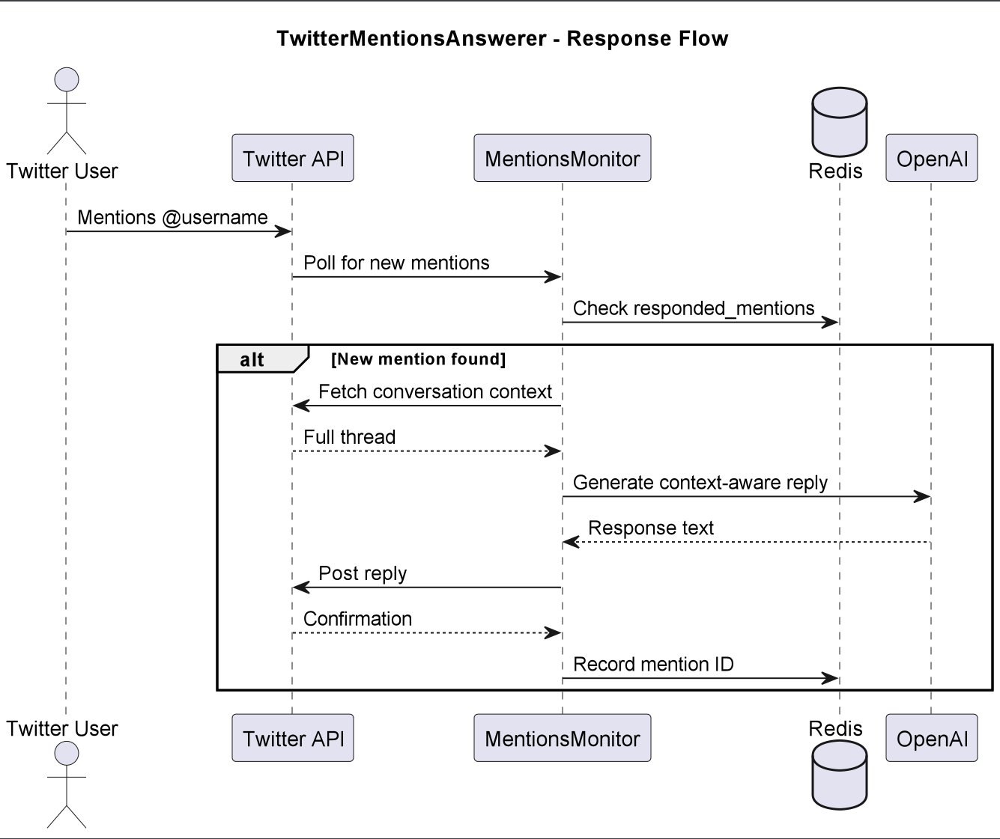

# TwitterMentionsAnswerer

## Purpose & Scope
TwitterMentionsMonitor is an autonomous agent that:
- Monitors and responds to Twitter mentions in real-time
- Analyzes conversation context before replying
- Maintains natural response timing to avoid spam detection

## Prerequisites
- Python 3.10+
- Twitter API v2 credentials with read/write permissions
- Redis for tracking responded mentions
- OpenAI API for generating context-aware replies

### Required Environment Variables
- `TWITTER_API_KEY` - Twitter developer API key
- `TWITTER_API_SECRET` - Twitter developer API secret  
- `OPENAI_API_KEY` - For generating intelligent replies
- `REDIS_URL` - Redis connection string (default: redis://localhost:6379)

## Quickstart
1. **Install dependencies:**
```bash
pip install -r requirements.txt
```

2. **Configure environment:**
```bash
export TWITTER_API_KEY="your_key"
export TWITTER_API_SECRET="your_secret"
export OPENAI_API_KEY="your_openai_key"
```

3. **Run the agent:**
```bash
python -m twitter_mentions_monitor.main
```

4. **Start monitoring mentions:**
```bash
curl -X POST http://localhost:8000/yourusername.keywords.hashtags
```
Where:
- `yourusername` = Twitter handle to monitor
- `keywords` = comma-separated terms to track
- `hashtags` = comma-separated relevant hashtags

# Architecture & Flow

## Overview
TwitterMentionsMonitor implements a real-time mention response system with:
- Continuous polling of Twitter mentions API
- Conversation context analysis
- Intelligent reply generation
- Anti-spam timing controls

## Component Diagram
See [`twitter_ambassador_mention_answerer_diagram`](images/diagrams/twitter_ambassador_mention_answerer.png) for a high-level sequence diagram, including:

Key components:
1. **Mention Fetcher** - Polls Twitter API for new @mentions
2. **Context Builder** - Retrieves full conversation threads
3. **Reply Generator** - Creates context-aware responses using OpenAI
4. **Rate Limiter** - Enforces minimum 2-minute delay between replies

## Flow Logic
1. **Mention Detection**:
   - Checks for new @mentions every 5 minutes
   - Filters out retweets and already-responded mentions
   - Validates mention requires response

2. **Context Analysis**:
   - Fetches entire conversation thread
   - Identifies keywords and conversation topic
   - Determines appropriate response tone

3. **Reply Posting**:
   - Generates human-like response
   - Enforces timing delays between replies
   - Records responded mentions in Redis

# API & Configuration Reference

## Public API Endpoint

### `POST /{goal}`
Starts monitoring mentions for specified account.

#### Request Format
```bash
username.keywords.hashtags
```

#### Parameters
| Component  | Description                          | Example             |
|------------|--------------------------------------|---------------------|
| `username` | Twitter handle to monitor            | `cryptodev`         |
| `keywords` | Comma-separated terms to track       | `defi,web3,staking` |
| `hashtags` | Comma-separated relevant hashtags    | `crypto,blockchain` |

#### Response
```json
{
  "status": "monitoring_started",
  "account": "username",
  "first_check_completed": true,
  "mentions_found": 3
}
```

## Configuration Options

### Environment Variables
```bash
# Required
export TWITTER_API_KEY="your_api_key"
export TWITTER_API_SECRET="your_api_secret"
export OPENAI_API_KEY="your_openai_key"

# Optional (with defaults)
export POLL_INTERVAL=300       # Check every 5 minutes
export MIN_REPLY_DELAY=120     # 2 minutes between replies
export MAX_HISTORY_DAYS=7      # Keep 7 days of history
```

### Rate Limits
- **API Checks**: 15 requests/hour
- **Replies**: 1 per 2 minutes per account
- **History**: Last 50 mentions stored

## Example Request
```bash
curl -X POST http://localhost:8000/cryptodev.defi,web3.crypto,blockchain
```

## Example Response
```json
{
  "status": "monitoring_started",
  "account": "cryptodev",
  "first_check_completed": true,
  "mentions_found": 2,
  "last_checked": "2023-11-15T14:30:00Z"
}
```

# Diagram



# Example workflow

```
#!/bin/bash
# TwitterMentionsMonitor - Basic Usage Examples

# 1. Start monitoring mentions
curl -s -X POST \
  -H "Content-Type: application/json" \
  -d '{"goal":"cryptodev.defi,web3.crypto,blockchain"}' \
  http://localhost:8000/

# Expected response:
# {
#   "status": "monitoring_started",
#   "account": "cryptodev",
#   "first_check_completed": true,
#   "mentions_found": 2
# }

# 2. Force immediate mention check
curl -s -X POST \
  -H "Content-Type: application/json" \
  -d '{"goal":"newsbot.ethereum,layer2", "force_check":true}' \
  http://localhost:8000/

# 3. Get response history
curl -s -X GET \
  http://localhost:8000/cryptodev/history

# Required environment variables:
# export TWITTER_API_KEY="your_twitter_key"
# export TWITTER_API_SECRET="your_twitter_secret"
# export OPENAI_API_KEY="your_openai_key"
# export REDIS_URL="redis://localhost:6379"
```