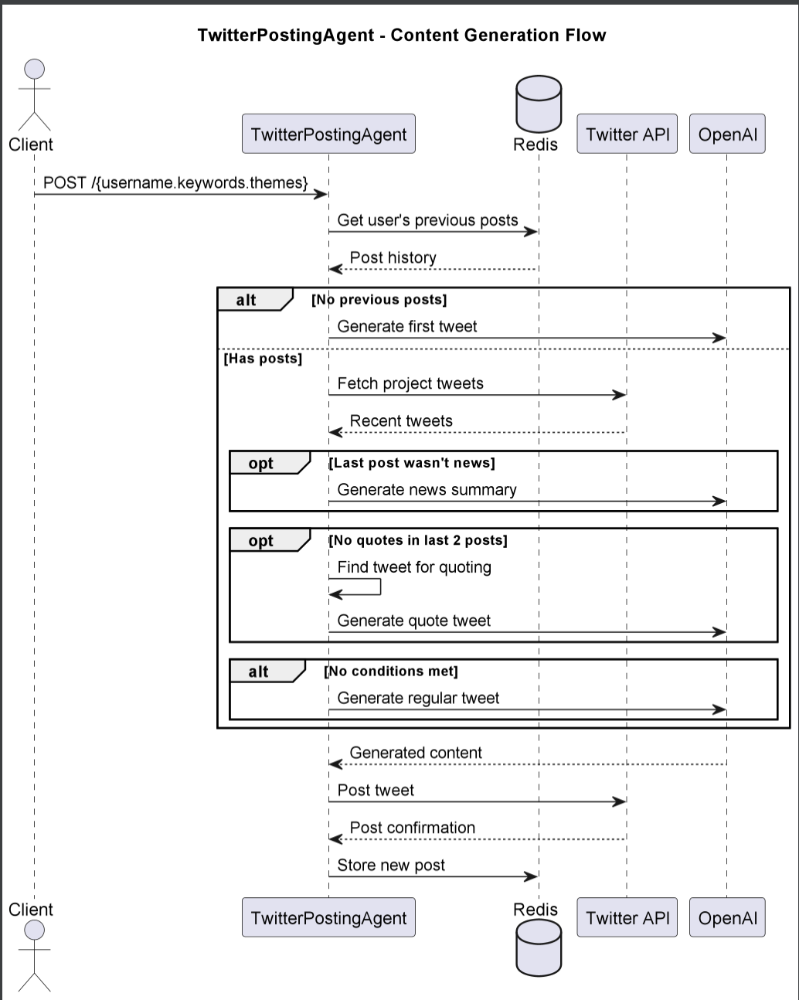

# TwitterPostingAgent

## Purpose & Scope
TwitterPostingAgent is an autonomous AI Twitter ambassador that:
- Generates and posts organic tweets for specified accounts
- Maintains natural posting rhythm with varied content types
- Ensures brand-aligned messaging using predefined prompts

## Prerequisites
- Python 3.10+
- FastAPI and Ray Serve for API endpoints
- Twitter API v2 credentials
- Redis for post history storage
- OpenAI API for content generation

### Required Environment Variables
- `TWITTER_API_KEY` - Twitter developer API key
- `TWITTER_API_SECRET` - Twitter developer API secret
- `OPENAI_API_KEY` - OpenAI API key for text generation
- `REDIS_URL` - Redis connection string (optional)

## Quickstart
1. **Install dependencies:**
   ```bash
   pip install -r requirements.txt
   ```

2. **Configure environment:**
   ```bash
   export TWITTER_API_KEY="your_twitter_key"
   export TWITTER_API_SECRET="your_twitter_secret" 
   export OPENAI_API_KEY="your_openai_key"
   ```

3. **Run the agent:**
   ```bash
   python -m twitter_posting_agent.main
   ```

4. **Trigger tweet generation:**
   ```bash
   curl -X POST http://localhost:8000/johndoe.defi,web3.crypto,blockchain
   ```
   Where:
   - `johndoe` = Twitter handle
   - `defi,web3` = content keywords
   - `crypto,blockchain` = theme hashtags

# Architecture & Flow

## Overview
TwitterPostingAgent uses a decision tree to determine optimal content type based on:
- User's posting history (from Redis)
- Recent project tweets (from Twitter API)
- Content generation rules (via OpenAI)

## Component Diagram
See [`twitter_ambassador_posting_agent_diagram`](images/diagrams/twitter_ambassador_posting_agent.png) for a high-level sequence diagram, including:

Key components:
1. **Request Handler** - Processes incoming POST requests
2. **Content Router** - Decides tweet type based on history
3. **Prompt Engine** - Formats OpenAI prompts for each content type
4. **Post Manager** - Handles Twitter API interactions

## Flow Logic
1. **New Accounts**:
   - Generates introductory tweet using base prompt
   - Stores first post in Redis

2. **Regular Posting Cycle**:
   - Checks last post type (news/regular/quote)
   - Maintains 1:2:1 ratio between news:regular:quote
   - Ensures no content type repetition

3. **Content Validation**:
   - Formats text with proper paragraph breaks
   - Ensures 260-character limit
   - Removes prohibited elements (hashtags/emojis)

# API & Configuration Reference

## Public API Endpoint

### `POST /{goal}`
Triggers tweet generation pipeline.

#### Request Format
```
username.keyword1,keyword2.theme1,theme2
```

#### Parameters
| Component    | Description                          | Example               |
|--------------|--------------------------------------|-----------------------|
| username     | Twitter handle to post as            | `cryptodev`           |
| keywords     | Comma-separated content focus terms  | `defi,web3,staking`   |
| themes       | Comma-separated hashtag categories   | `crypto,blockchain`   |

#### Response
```json
{
  "status": "posted|queued|failed",
  "tweet_id": "1234567890",
  "content": "Generated tweet text...",
  "type": "regular|news|quote"
}
```

## Content Generation Rules

### Prompt Templates
1. **Regular Tweets** (`PROMPT_FOR_TWEET`):
   - Max 260 characters
   - Double line breaks between thoughts
   - Strictly no emojis/hashtags

2. **Quote Tweets** (`PROMPT_FOR_QUOTED_TWEET`):
   - Comments on existing tweets
   - Adds original insights
   - Maintains conversational flow

3. **News Summaries** (`PROMPT_FOR_NEWS_TWEET`):
   - Aggregates multiple sources
   - Provides neutral analysis
   - Links to project themes

## Configuration
```python
# Content formatting rules
MAX_LENGTH = 260
PARAGRAPH_BREAKS = True
ALLOWED_CONTENT_TYPES = ["regular", "news", "quote"]
```

# Diagram



# Example workflow

```
#!/bin/bash
# TwitterPostingAgent - Basic Interaction Examples

# 1. Post regular tweet
curl -s -X POST \
  -H "Content-Type: application/json" \
  -d '{"goal":"cryptodev.defi,web3.crypto,blockchain"}' \
  http://localhost:8000/

# Expected response format:
# {
#   "status": "posted",
#   "tweet_id": "1689264827354624",
#   "content": "DeFi is rebuilding finance from ground up.\n\nWeb3 brings verifiable ownership models.\n\nThe future is decentralized.",
#   "type": "regular"
# }

# 2. Force news summary tweet
curl -s -X POST \
  -H "Content-Type: application/json" \
  -d '{"goal":"newsbot.ethereum,layer2.scaling", "force_type":"news"}' \
  http://localhost:8000/

# 3. Get posting history
curl -s -X GET \
  http://localhost:8000/cryptodev/history

# Environment variables required:
# export TWITTER_API_KEY="your_twitter_key"
# export TWITTER_API_SECRET="your_twitter_secret"
# export OPENAI_API_KEY="your_openai_key"
# export REDIS_URL="redis://localhost:6379"

# Rate limits:
# - Max 3 posts/hour per account
# - 10 concurrent generation processes
```