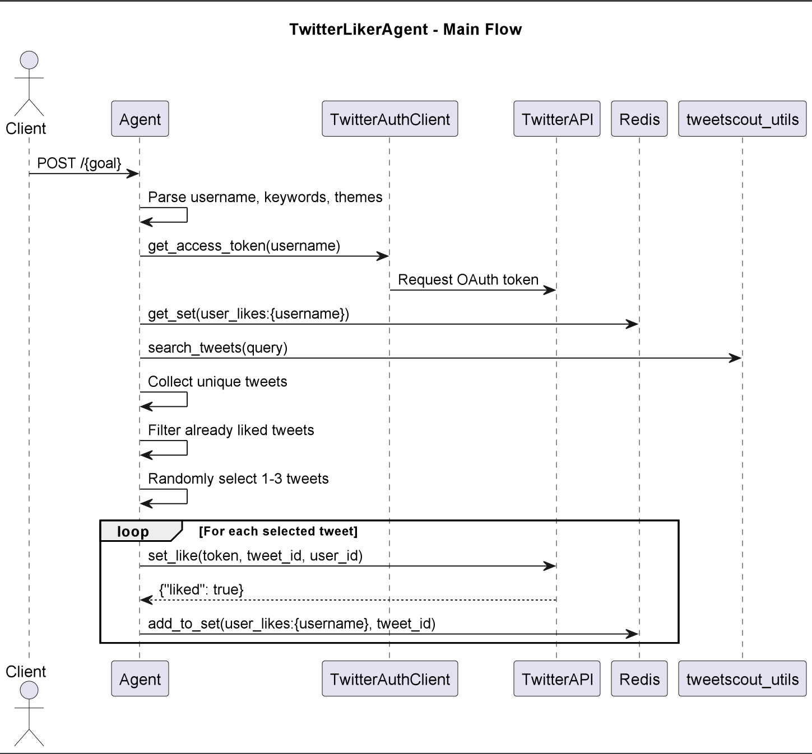

# TwitterLikerAgent

## Purpose & Scope

TwitterLikerAgent is a Ray Serve-based microservice that searches for tweets based on given keywords and themes, then likes a random selection of them using the user's Twitter account.

## Prerequisites

- Python 3.10+
- Ray Serve runtime
- Redis database
- Twitter developer credentials (handled via `TwitterAuthClient`)
- Dependencies from internal Praxis CodeArtifact repository

### Required Environment Variables

- `TWITTER_CLIENT_ID`, `TWITTER_CLIENT_SECRET` — Twitter API credentials
- Redis host credentials (implicitly used by `get_redis_db`)
- Internal packages must be resolvable via Poetry and configured source

## Quickstart

1. **Install dependencies:**

   ```bash
   poetry install
2. **Run the agent locally using Ray Serve:**
    
    ```bash
   poetry run python twitter_ambassador_liker/entrypoint.py
   ```
3. **Send a test request:**

    ```bash
   curl -X POST http://localhost:8000/myusername.keyword1-keyword2.theme1-theme2
   ```

**The agent will:**

 - Retrieve access token for myusername

 - Search for tweets using keyword1, keyword2, theme1, theme2

 - Like up to 3 unseen tweets

 - Store liked tweet IDs in Redis to prevent duplication

# Architecture & Flow

## Overview

The `TwitterLikerAgent` is a Ray Serve-based agent that automatically likes tweets on behalf of a specified Twitter user. It uses a goal string to derive keywords and themes, searches for relevant tweets, filters out already liked ones using Redis, and then performs like actions via the Twitter API.

## Component Diagram

See [`twitter_liker_agent_diagram`](images/diagrams/twitter_liker_agent.png) for a high-level sequence diagram, including:
- The FastAPI + Ray Serve deployment
- External service dependencies: Twitter API and Redis
- Internal utility packages: `twitter_ambassador_utils`, `tweetscout_utils`, and `redis_client`

## Flow Description

1. **User sends POST /{goal} request** to the agent.
2. The agent:
   - Parses the `goal` string into `username`, `keywords`, and `themes`
   - Authenticates with Twitter using `TwitterAuthClient`
   - Retrieves the set of previously liked tweets from Redis
   - Performs searches via `search_tweets()` for both keywords and themes
   - Filters out already liked tweets
   - Likes 1 to 3 new tweets using the Twitter API (`set_like`)
   - Records liked tweet IDs back into Redis

This process ensures that no tweet is liked more than once, and introduces randomized timing to simulate human-like behavior.

# API & Configuration Reference

## Public Endpoint

### `POST /{goal}`

Triggers the Twitter liking behavior for a given user and goal definition.

#### Path Parameters

- `goal` — a dot-delimited string composed of:
  - **Username** — the Twitter username to act as (e.g. `myuser`)
  - **Keywords** — one or more search terms (e.g. `python-ai`)
  - **Themes** — one or more theme tags (e.g. `startup-research`)

**Example:**
```
POST /myuser.python-ai.startup-research
```

#### Request Body

The request body is optional and may include a `plan` dictionary (currently unused):

```json
{
  "plan": {
    "like_limit": 3
  }
}
```

#### Behavior

- Parses the goal string into username, keywords, and themes.
- Uses `tweetscout_utils.search_tweets` to find tweets.
- Filters tweets already liked (stored in Redis).
- Likes 1–3 random tweets not previously liked.
- Tracks newly liked tweet IDs in Redis.

#### Response

Returns HTTP 200 OK on completion. No body is returned.

---

## Configuration Reference

### Redis Keys

- `user_likes:{username}` — Redis Set storing tweet IDs liked by the user.

### Required Environment Variables

| Variable                 | Description                            |
|--------------------------|----------------------------------------|
| `TWITTER_CLIENT_ID`      | Twitter OAuth client ID                |
| `TWITTER_CLIENT_SECRET`  | Twitter OAuth client secret            |
| Redis credentials        | Used implicitly by `get_redis_db()`    |

All environment variables are assumed to be managed securely outside the code.

# Diagram



# Example workflow

```
#!/bin/bash

# Input: johndoe.coffee.technology

curl -X POST http://localhost:8000/johndoe.coffee.technology

# Output: None
```