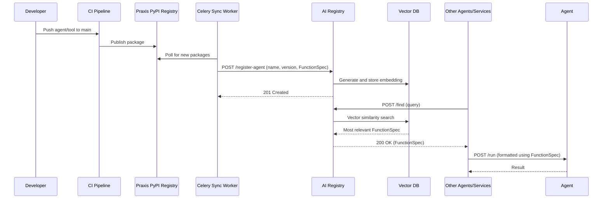

# AI Registry

Praxis Internal Service Reference
*Last updated: 2025-06-09*

---

## Overview

The **AI Registry** is a core internal service of Praxis that acts as the central registry and discovery mechanism for AI Agents and Tools. It enables consistent, versioned, and structured definitions for agent capabilities and supported operations via OpenAI-compatible Function Specifications. The registry is critical to enabling dynamic, multi-agent orchestration within the Praxis ecosystem.

### Key Features

* **FunctionSpec Registry**: Stores OpenAI-style function specs for agents and tools.
* **Semantic Versioning**: Supports semver-based versioning of registered specs.
* **Agent Discovery**: Enables runtime discovery and introspection of agents.
* **Dynamic Routing Support**: Allows service orchestration layers to route calls based on capability metadata.
* **OpenAPI Compliant**: Full OpenAPI spec available for integration with clients.
* **Embeddings & Similarity Search**: Computes and stores vector embeddings for all agents/tools in Qdrant.
* **/find Endpoints**: Returns the most relevant agent/tool using vector similarity.
* **Background Sync with PyPI**: Celery-based service syncs the latest agent/tool specs from PyPI into the registry.

### Role Within Praxis

AI Registry powers agent coordination by exposing standardized interfaces for function execution, providing the metadata needed for runtime decisions, and acting as the canonical source of truth for agent and tool capabilities. It is deeply integrated into the **Base Agent**, enabling native discovery and invocation of relevant tools.

---

## How It Works

The AI Registry is a REST-based service that receives POST requests from services wishing to register, update, or look up agent or tool definitions. Each agent/tool is represented by a structured schema (OpenAI-compatible), and identified by a name and version. Clients use the registry at runtime to dynamically select the appropriate agent or tool to invoke.

A background **Celery worker** regularly fetches new or updated agent/tool packages from the **Praxis PyPI Registry**, extracts their function specifications, and updates the internal database accordingly. In addition, embeddings for each spec are computed and stored in **Qdrant**, enabling powerful semantic search via the `/find` endpoints.

### Basic Flow

1. Developer creates or updates an agent/tool in the respective repository and merges to `main`.
2. A CI pipeline builds the package and publishes it to the Praxis PyPI Registry.
3. A Celery-based background service periodically fetches new or updated packages.
4. The AI Registry registers the tool/agent with a POST request.
5. Embeddings are generated and stored in Qdrant for semantic search.
6. At runtime, agents and services use `/find` endpoints to retrieve the most relevant agent or tool.



---

## Architecture Diagrams

### C4 Context Diagram

```plantuml
@startuml
!include https://raw.githubusercontent.com/plantuml-stdlib/C4-PlantUML/master/C4_Context.puml

Person(dev, "Developer")
System_Boundary(praxis, "Praxis") {
    System(ai_registry, "AI Registry", "Central registry for AI agents and tools")
    System_Ext(agent_runtime, "Agent Runtime")
    System_Ext(orchestrator, "Service Orchestrator")
    System_Ext(pypi, "Praxis PyPI Registry")
    System_Ext(qdrant, "Qdrant Vector DB")
}

Rel(dev, ai_registry, "Registers agents/tools")
Rel(orchestrator, ai_registry, "Discovers agents/tools at runtime")
Rel(agent_runtime, ai_registry, "Fetches specs")
Rel(ai_registry, pypi, "Fetches specs via Celery")
Rel(ai_registry, qdrant, "Stores embeddings")
Rel(ai_registry, qdrant, "Performs vector search")

@enduml
```

---

## OpenAPI Specification

- [View AI Registry Swagger UI](https://ai-registry.dev.prxs.ai/docs#/)

---

## Example Registration Payload

### Agent Registration (`POST /agents`)

```json
{
  "version": "1.0.0",
  "description": "string",
  "parent_agent_ids": [
    0
  ],
  "metadata": {},
  "name": "string"
}
```

*This payload is automatically generated and sent by the Celery sync worker.*

### Tool Registration (`POST /tools`)

```json
{
  "version": "1.0.0",
  "openai_function_spec": "string",
  "mode": "sync",
  "name": "string"
}
```

*This payload is also generated and submitted by the Celery sync worker.*

### Agent Semantic Search (`POST /agents/find`)

```json
{
  "goal": "string"
}
```

*Used by services to find the most relevant agent for a given goal.*

### Tool Semantic Search (`POST /tools/find`)

```json
{
  "goal": "string"
}
```

*Used by services to find the most relevant tool for a given goal.*

---
