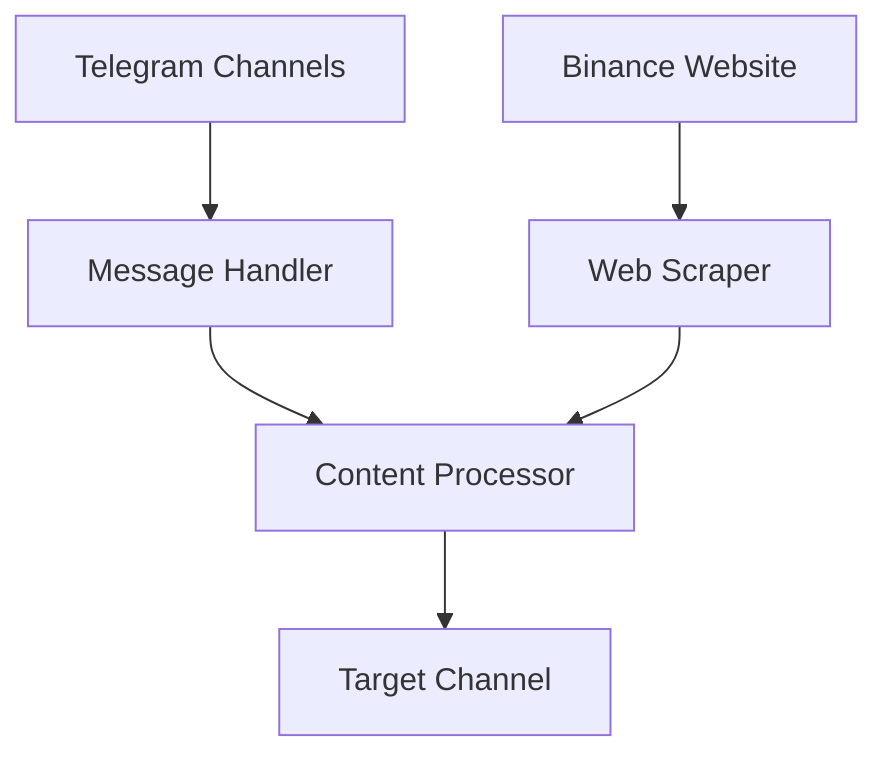
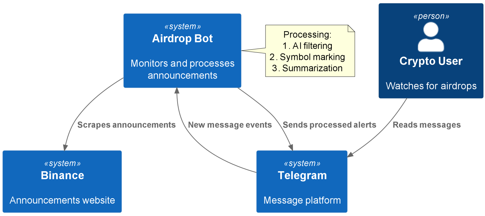

# Airdrop Bot Tool

Monitors crypto channels and websites for airdrop announcements, processes the content, and forwards validated alerts to Telegram.

## Quickstart

```python
from airdrop_bot.main import main

# Run the bot (handles both Telegram monitoring and web scraping)
asyncio.run(main())
```

## How It Works

1. **Telegram Monitoring**: Listens to specified crypto channels for new messages
2. **Web Scraping**: Crawls Binance announcements using Playwright
3. **Content Processing**: Filters and summarizes relevant airdrop info
4. **Forwarding**: Sends processed alerts to target Telegram channel

### Architecture


## Source Code Links
- Key Components:
  - [main.py](https://github.com/prxs-ai/praxis-tool-examples/blob/main/tools/airdrop_bot/main.py) (Orchestration)
  - [ai_parser.py](https://github.com/prxs-ai/praxis-tool-examples/blob/main/tools/airdrop_bot/tasks/parsers/ai_parser.py) (Web Scraper)
  - [base_processor.py](https://github.com/prxs-ai/praxis-tool-examples/blob/main/tools/airdrop_bot/tasks/processors/base_processor.py) (Processing Core)
  - [process_*.py](https://github.com/prxs-ai/praxis-tool-examples/blob/main/tools/airdrop_bot/tasks/processors) (Content Processors)

## Requirements & Setup

### Prerequisites
- Python ≥3.10
- Libraries: `playwright`, `telethon`, `bs4`, `openai`
- Chrome browser (for Playwright)

### Installation
```bash
playwright install
poetry install
```

### Configuration
```python
# config.py
API_ID = 12345  # Telegram API ID
API_HASH = "your_api_hash"
GROUPS_TO_MONITOR = [-100123456]  # Telegram channel IDs
TARGET_CHAT = "@your_channel"  # Output channel
```

## Key Features

### Web Scraper
```python
scraper = AsyncWebScraper(
    base_url="https://binance.com/announcements",
    max_depth=2,
    max_tasks=3,
    max_links=100
)
```

### Content Processing Pipeline
1. Filters messages with AI (GPT-4)
2. Adds `$` before crypto symbols (e.g., "ETH" → "$ETH")
3. Summarizes long announcements

### Telegram Integration
- Listens to multiple channels
- Preserves media attachments
- Rate-limited to avoid bans

## Error Handling
- Exponential backoff for failed requests
- Automatic retries for OpenAI API
- Comprehensive logging

### C4 Context
See [`airdrop_bot.puml`](./images/diagrams/airdrop_bot/airdrop_bot.puml) for a high-level sequence:



### Crypto Symbols Processed
```
ETH, BTC, BSC, ADA, SOL, AVAX, DOT, LUNA,
DOGE, SHIB, MATIC, XRP, BNB, UNI, FDUSD,
USDT, USDC
```

## Monitoring
- Logs all processed messages
- Tracks source channels/URLs
- Records processing decisions
