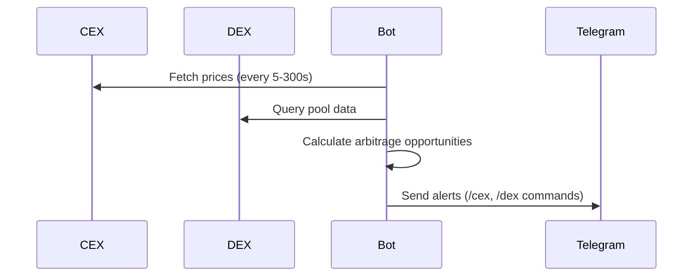
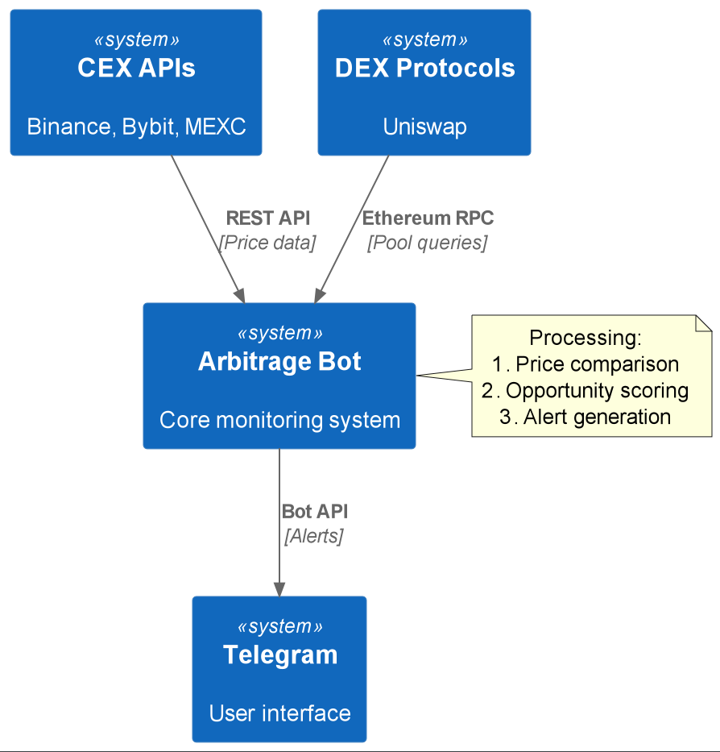

# Arbitrage Bot Tool

Identifies and reports cryptocurrency price differences across centralized (CEX) and decentralized (DEX) exchanges.

## Quickstart

```python
from arbitrage_bot.main import main

# Start the bot (launches price monitoring and Telegram interface)
asyncio.run(main())
```

## How It Works

1. **Data Collection**:
   - CEX prices via exchange APIs (Binance, Bybit, MEXC)
   - DEX prices via Ethereum node queries
2. **Arbitrage Detection**: Calculates price differences in real-time
3. **Reporting**: Sends alerts via Telegram bot

### Monitoring Flow


## Source Code Links
- Core Components:
  - [main.py](https://github.com/prxs-ai/praxis-tool-examples/blob/main/tools/arbitrage_bot/main.py) (Orchestration)
  - [bot.py](https://github.com/prxs-ai/praxis-tool-examples/blob/main/tools/arbitrage_bot/bot/bot.py) (Telegram interface)
  - [dynamic_messages.py](https://github.com/prxs-ai/praxis-tool-examples/blob/main/tools/arbitrage_bot/bot/messages/dynamic_messages.py) (Alert formatting)
- Data Collectors:
  - [cex/](https://github.com/prxs-ai/praxis-tool-examples/blob/main/tools/arbitrage_bot/tools/sources/cex) (Centralized exchange modules)
  - [dex/](https://github.com/prxs-ai/praxis-tool-examples/blob/main/tools/arbitrage_bot/tools/sources/dex) (Decentralized exchange modules)

## Requirements & Setup

### Prerequisites
- Python ≥3.10
- Libraries: `aiogram`, `web3`, `aiohttp`, `sqlalchemy`
- Ethereum RPC endpoint
- Exchange API keys (for CEX)

### Installation
```bash
poetry install
playwright install  # For web-based price checks
```

### Configuration
```python
# config.py
BYBIT_API_KEY = "your_key"
BYBIT_API_SECRET = "your_secret"
ETH_RPC_URL = "https://rpc.ankr.com/eth"
TELEGRAM_BOT_TOKEN = "your_bot_token"
```

## Key Features

### Telegram Commands
- `/cex` - Show CEX-CEX arbitrage opportunities
- `/dex` - Show DEX-CEX arbitrage opportunities
- `/help` - List available commands

### Alert Format Example
```
Binance (1.002) <-> Bybit (0.998) ETH/USDT 0.40%
Uniswap (1.005) <-> Binance (0.995) ETH/USDT 1.02%‼️
```

### Supported Exchanges
| Type | Exchanges |
|------|-----------|
| CEX  | Binance, Bybit, MEXC |
| DEX  | Uniswap (Ethereum) |

### C4 Context
See [`arbitrage_bot.puml`](./images/diagrams/arbitrage_bot/arbitrage_bot.puml) for a high-level sequence:




## Database Integration
- Materialized views for fast price comparisons
- Automatic schema initialization
- Supports PostgreSQL

## Error Handling
- Exponential backoff for API rate limits
- Connection retries for RPC nodes
- Comprehensive logging

## Performance
- Parallel data collection
- Configurable update intervals (5-300 seconds)
- Efficient message batching (under 4096 chars)
