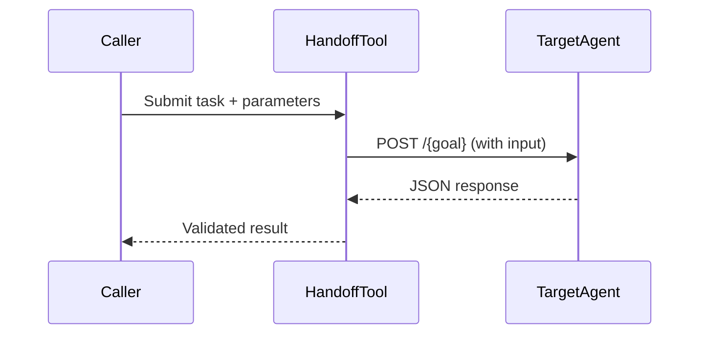
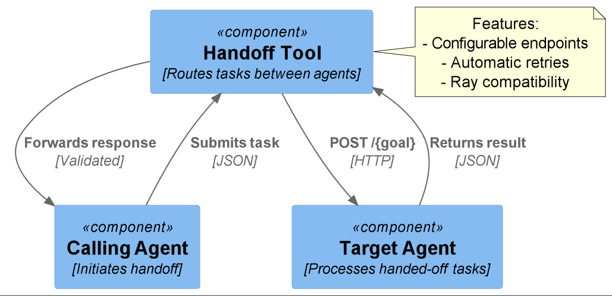

# Handoff Tool

Facilitates seamless task handoffs between different agents via configurable HTTP endpoints.

## Quickstart

```python
from handoff_tool.main import HandoffTool
from handoff_tool.config import get_handoff_endpoints_config

tool = HandoffTool(get_handoff_endpoints_config())
result = tool({"task": "process_data", "params": {"id": 123}})
# Returns: {"status": "handoff_complete", "next_agent": "processor_agent"}
```

## How It Works

1. **Request Preparation**: Formats input according to configured endpoint
2. **Execution**: Makes HTTP request with retry logic
3. **Response Handling**: Returns validated JSON response

### Flow


## Source Code Links
- Core Components:
  - [main.py](https://github.com/prxs-ai/praxis-tool-examples/blob/main/tools/handoff-tool/src/handoff_tool/main.py) (Request handling)
  - [config.py](https://github.com/prxs-ai/praxis-tool-examples/blob/main/tools/handoff-tool/src/handoff_tool/config.py) (Endpoint configuration)
  - [models.py](https://github.com/prxs-ai/praxis-tool-examples/blob/main/tools/handoff-tool/src/handoff_tool/models.py) (Data validation)

## Requirements & Setup

### Prerequisites
- Python ≥3.10
- Libraries: `requests`, `pydantic`, `tenacity`, `ray`

### Configuration
Environment variables:
```bash
export HANDOFF_TOOL__ENDPOINT="http://agent-service:8000"
export HANDOFF_TOOL__PATH="/tasks/{goal}"
export HANDOFF_TOOL__METHOD="POST"
```

### Installation
```bash
poetry install
```

## Key Features

### Retry Mechanism
- 5 maximum attempts
- Exponential backoff (4-10 seconds)
- Automatic HTTP error handling

### Request Configuration
```python
class HandoffToolConfig(BaseSettings):
    endpoint: str  # Base agent URL
    path: str = "/{goal}"  # Path template
    method: str = "POST"  # HTTP method
    params: dict[str, Any]  # Path parameters
```

## Ray Integration

```python
import ray
from handoff_tool.ray_entrypoint import main

ray.init()
result = ray.get(main.remote({
    "task": "image_processing",
    "priority": "high"
}))
# Returns: {"result": "handled_to_vision_agent"}
```

### Distributed Features
- 0.5 CPU reservation per task
- Input/output serialization
- Cluster-ready execution

### C4 Context
See [`handoff_tool.puml`](./images/diagrams/handoff_tool/handoff_tool.puml) for a high-level sequence:




## Error Handling
- Validates inputs with Pydantic
- Retries on connection failures
- Preserves Ray workflow state

## Response Structure
```python
class HandoffResult(BaseModel):
    result: str  # Status or output from target agent
```

### Typical Responses
- `{"result": "task_accepted"}`
- `{"result": "processing_started"}`
- `{"result": "retry_later"}`

## Usage Guidelines
1. Configure endpoints via environment variables
2. Ensure target agents implement expected API
3. Handle 400/500 errors in calling code
