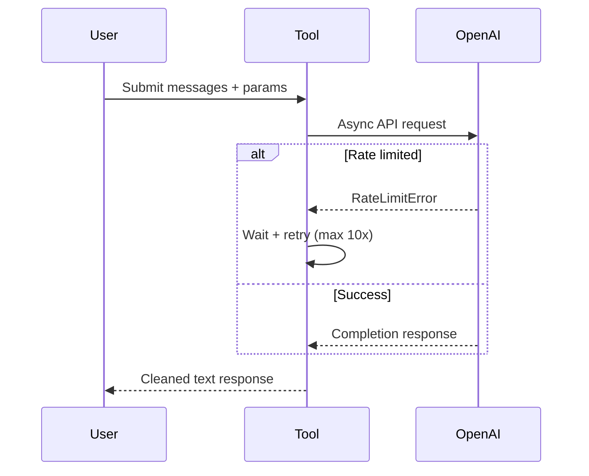
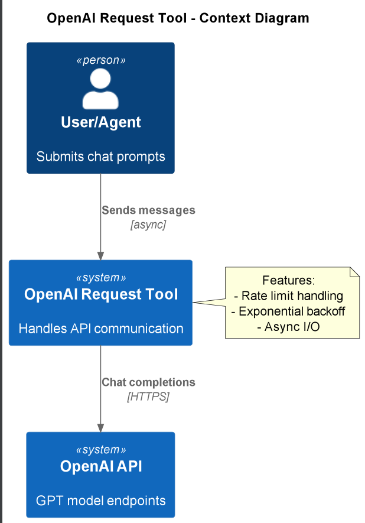

# OpenAI Request Tool

Handles asynchronous requests to OpenAI's chat completion API with built-in rate limit retries and Ray integration.

## Quickstart

```python
from openai_request.main import main

response = await main(
    messages=[{"role": "user", "content": "Explain AI in simple terms"}],
    temperature=0.7
)
# Returns: "AI is like teaching computers to think and learn..."
```

## How It Works

1. **Request Initialization**: Creates async OpenAI client with configured API key
2. **Retry Mechanism**: Automatically handles rate limits with exponential backoff
3. **Response Processing**: Returns cleaned completion content

### Flow


## Source Code Links
- Key Files:
  - [main.py](https://github.com/prxs-ai/praxis-tool-examples/blob/main/tools/openai_request/src/openai_request/main.py) (Core request logic)
  - [config.py](https://github.com/prxs-ai/praxis-tool-examples/blob/main/tools/openai_request/src/openai_request/config.py) (API key management)
  - [ray_entrypoint.py](https://github.com/prxs-ai/praxis-tool-examples/blob/main/tools/openai_request/src/openai_request/ray_entrypoint.py) (Distributed execution)

## Requirements & Setup

### Prerequisites
- Python ≥3.10
- Libraries: `openai`, `pydantic`, `ray`

### Installation
```bash
poetry install
```

### Configuration
Set OpenAI API key:
```bash
export OPENAI_API_KEY="sk-your-key-here"
```

## Architecture

### C4 Context
See [`openai_request.puml`](./images/diagrams/openai_request/openai_request.puml) for a high-level sequence:



### Data Models
```python
class InputModel(BaseModel):
    messages: list           # Chat message history
    temperature: float = 1   # Creativity control (0-2)
    model: str = "gpt-4"     # Default model

class OutputModel(BaseModel):
    response: Optional[str]  # Null on failure
```

## Ray Integration

```python
import ray
from openai_request.ray_entrypoint import main

ray.init()
result = ray.get(main.remote({
    "messages": [{"role": "user", "content": "Explain quantum computing"}]
}))
# Returns: {"response": "Quantum computing uses qubits..."}
```

### Error Handling
- 10 max retries for rate limits
- Exponential backoff starts at 0.5s
- Full error logging

### Key Characteristics
1. Async-first implementation
2. Configurable retry strategy
3. Pydantic input validation
4. Seamless Ray serialization