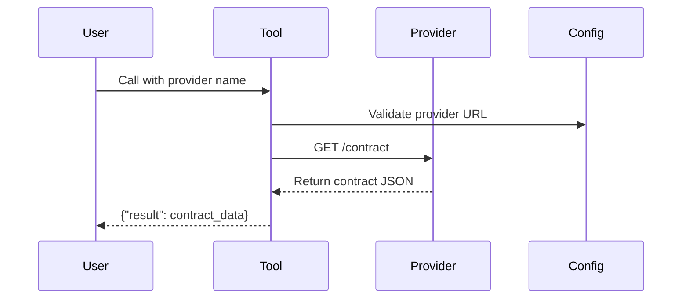
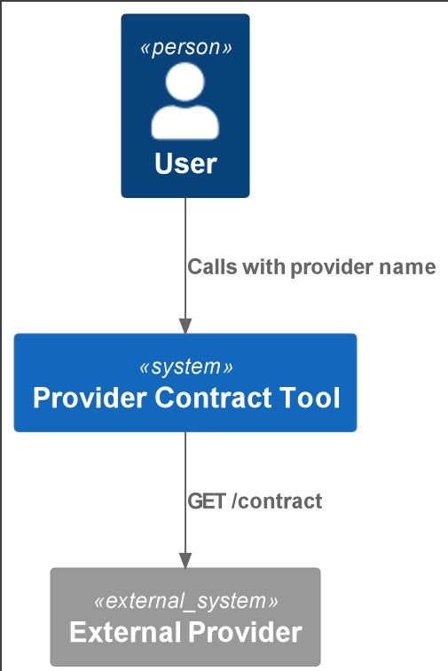

# Provider Contract Tool

Fetches contract specifications (schemas, metadata, SLAs) from external providers via their `/contract` endpoint.

## Quickstart

```python
from provider_contract_tool.config import get_provider_contract_tool_config
from provider_contract_tool.main import ProviderContractTool

# Initialize with default config (loads from .env or environment variables)
config = get_provider_contract_tool_config()
tool = ProviderContractTool(config)

# Fetch contract for a provider (e.g., "tweets_provider")
contract = tool("tweets_provider")  # Returns {"result": {...}}
```

**Minimal `.env` setup**:
```ini
PROVIDER_CONTRACT_TOOL_PROVIDERS='{"tweets_provider": "http://api.example.com"}'
```

## How It Works

1. **Config Load**: Reads provider URLs and API version from env vars/`.env`.
2. **Validation**: Validates provider name against configured URLs.
3. **Retry Logic**: Automatically retries failed requests (5 attempts, exponential backoff).
4. **Endpoint Call**: Requests `GET {provider_url}/{api_version}/contract`.

### Flow


## Source Code Links
- Key Files:
  - [main.py](https://github.com/prxs-ai/praxis-tool-examples/blob/main/tools/provider-contract-tool/src/provider_contract_tool/main.py) (Core logic)
  - [config.py](https://github.com/prxs-ai/praxis-tool-examples/blob/main/tools/provider-contract-tool/src/provider_contract_tool/config.py) (Env configuration)
  - [models.py](https://github.com/prxs-ai/praxis-tool-examples/blob/main/tools/provider-contract-tool/src/provider_contract_tool/models.py) (Pydantic schemas)

## Requirements & Setup

### Prerequisites
- Python ≥3.10
- Libraries: `pydantic`, `requests`, `tenacity`, `pydantic-settings`,`ray` (optional)

### Installation
```bash
poetry install
```

### Environment Variables
| Variable | Example | Description |
|----------|---------|-------------|
| `PROVIDER_CONTRACT_TOOL_API_VERSION` | `v1` | API version prefix |
| `PROVIDER_CONTRACT_TOOL_PROVIDERS` | `{"provider1": "http://url"}` | Provider URL mappings |

## Architecture

### C4 Context

See [`provider_contract_tool.puml`](./images/diagrams/provider_contract_tool/provider_contract_tool.puml) for a high-level sequence:




### Ray Integration
For distributed workflows, use the `ray_entrypoint.py` wrapper:
```python
import ray
from provider_contract_tool.ray_entrypoint import main

ray.init()
result = ray.get(main.remote(input_kwargs={"provider": "tweets_provider"}))
```

