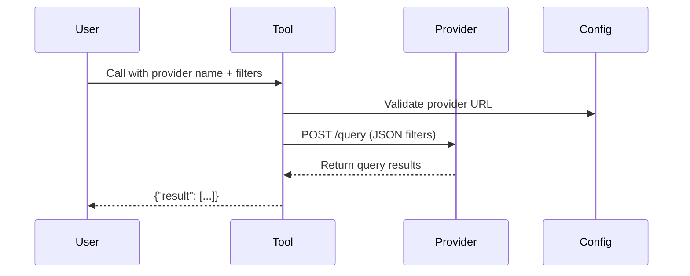
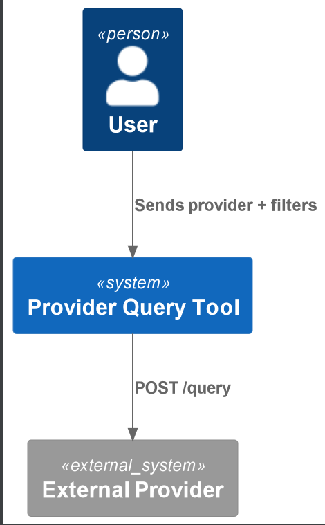

# Provider Query Tool

Sends queries with filters to external providers via their `/query` endpoint and returns structured results.

## Quickstart

```python
from provider_query_tool.config import get_provider_query_tool_config
from provider_query_tool.main import ProviderQueryTool

# Initialize with default config (loads from .env or environment variables)
config = get_provider_query_tool_config()
tool = ProviderQueryTool(config)

# Query a provider with filters
result = tool("example_provider", {"date": "2023-01-01", "limit": 10})  # Returns {"result": [...]}
```

**Minimal `.env` setup**:
```ini
PROVIDER_QUERY_TOOL_PROVIDERS='{"example_provider": "http://api.example.com"}'
```

## How It Works

1. **Config Load**: Reads provider URLs and API version from env vars/`.env`.
2. **Validation**: Validates provider name against configured URLs.
3. **Retry Logic**: Automatically retries failed requests (5 attempts, exponential backoff).
4. **Endpoint Call**: Sends `POST {provider_url}/{api_version}/query` with filters as JSON.

### Flow


## Source Code Links
- Key Files:
  - [main.py](https://github.com/prxs-ai/praxis-tool-examples/blob/main/tools/provider-query-tool/src/provider_query_tool/main.py) (Core query logic)
  - [config.py](https://github.com/prxs-ai/praxis-tool-examples/blob/main/tools/provider-query-tool/src/provider_query_tool/config.py) (Environment configuration)
  - [models.py](https://github.com/prxs-ai/praxis-tool-examples/blob/main/tools/provider-query-tool/src/provider_query_tool/models.py) (Pydantic schemas)

## Requirements & Setup

### Prerequisites
- Python ≥3.10
- Libraries: `pydantic`, `requests`, `tenacity`, `pydantic-settings`,`ray` (optional)

### Installation
```bash
poetry install
```

### Environment Variables
| Variable | Example | Description |
|----------|---------|-------------|
| `PROVIDER_QUERY_TOOL_API_VERSION` | `v1` | API version prefix |
| `PROVIDER_QUERY_TOOL_PROVIDERS` | `{"provider1": "http://url"}` | Provider URL mappings |

## Architecture

### C4 Context
See [`provider_query_tool.puml`](./images/diagrams/provider_query_tool/provider_query_tool.puml) for a high-level sequence:



### Ray Integration
For distributed workflows:
```python
import ray
from provider_query_tool.ray_entrypoint import main

ray.init()
result = ray.get(main.remote(input_kwargs={
    "provider": "example_provider",
    "filters": {"date": "2023-01-01"}
}))
```

### Error Handling
The tool will:
- Raise `ValueError` for unknown providers
- Raise `RuntimeError` for failed requests (after retries)
- Validate inputs/outputs via Pydantic models

### Key differences from the contract tool:
1. Uses `POST` instead of `GET`
2. Accepts dynamic filters as input
3. Returns array-like results instead of contract specs
4. Same retry/validation patterns
