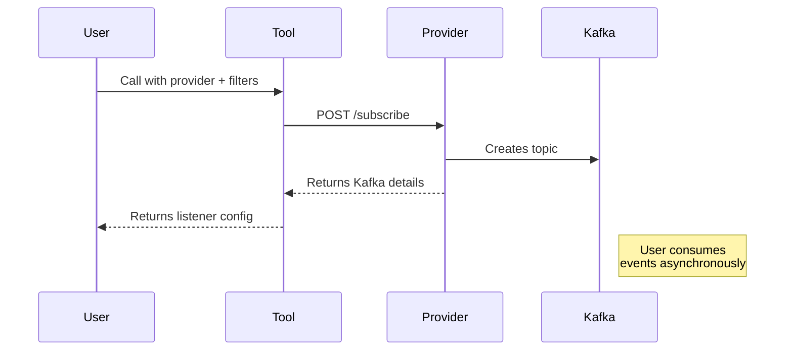
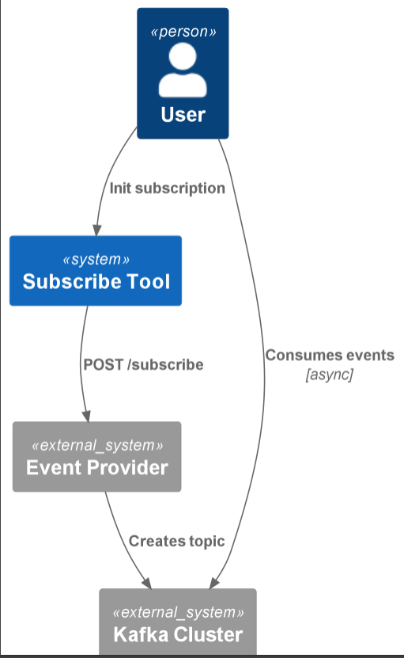

# Provider Subscribe Tool (Async)

Establishes asynchronous subscriptions to external providers via their `/subscribe` endpoint and returns Kafka connection parameters for streaming results.

## Quickstart

```python
from provider_subscribe_tool_async.config import get_provider_subscribe_tool_config
from provider_subscribe_tool_async.main import ProviderSubscribeTool

# Initialize with default config
config = get_provider_subscribe_tool_config()
tool = ProviderSubscribeTool(config)

# Subscribe to provider with filters
subscription = tool("events_provider", {"event_types": ["price_updates"]})
# Returns: {
#   "execution_params": {
#     "type": "async",
#     "engine": "event_listener",
#     "listener_type": "kafka",
#     "topic": "provider-events-123",
#     "kafka_bootstrap_uri": "kafka:9092"
#   }
# }
```

**Minimal `.env` setup**:
```ini
PROVIDER_SUBSCRIBE_TOOL_PROVIDERS='{"events_provider": "http://events.example.com"}'
```

## How It Works

1. **Subscription Init**: POSTs filters to provider's `/subscribe` endpoint
2. **Stream Setup**: Receives Kafka topic and connection details
3. **Async Handoff**: Returns parameters for downstream event listeners

### Flow


## Source Code Links
- Key Files:
  - [main.py](https://github.com/prxs-ai/praxis-tool-examples/blob/main/tools/provider-subscribe-tool-async/src/provider_subscribe_tool_async/main.py) (Subscription logic)
  - [config.py](https://github.com/prxs-ai/praxis-tool-examples/blob/main/tools/provider-subscribe-tool-async/src/provider_subscribe_tool_async/config.py) (Provider configuration)
  - [models.py](https://github.com/prxs-ai/praxis-tool-examples/blob/main/tools/provider-subscribe-tool-async/src/provider_subscribe_tool_async/models.py) (Structured output types)

## Requirements & Setup

### Prerequisites
- Python ≥3.10
- Libraries: `pydantic`, `requests`, `tenacity`, `ray`, `pydantic-settings`
- Kafka consumer for processing events

### Installation
```bash
poetry install
```

### Environment Variables
| Variable | Example | Description |
|----------|---------|-------------|
| `PROVIDER_SUBSCRIBE_TOOL_API_VERSION` | `v1` | API version prefix |
| `PROVIDER_SUBSCRIBE_TOOL_PROVIDERS` | `{"events": "http://events.internal"}` | Provider endpoints |

## Architecture

### C4 Context
See [`provider_subscribe_tool_async.puml`](./images/diagrams/provider_subscribe_tool_async/provider_subscribe_tool_async.puml) for a high-level sequence:



### Output Structure
The tool returns strictly typed execution parameters:
```python
class ExecParams(BaseModel):
    type: Literal["async"]  # Always "async"
    engine: Literal["event_listener"]  # Consumption method
    listener_type: Literal["kafka"]  # Currently only Kafka
    topic: str  # Assigned Kafka topic
    kafka_bootstrap_uri: str  # Connection string
```

### Error Handling
The tool will:
- Validate provider configuration before subscription
- Retry failed requests (5 attempts with backoff)
- Verify complete Kafka parameters in response
- Enforce output schema via Pydantic


### Key differences from sync tools:
1. Returns async consumption parameters instead of immediate data
2. Requires downstream Kafka consumer implementation
3. Providers must support subscription workflow
4. Structured output for event listener configuration
