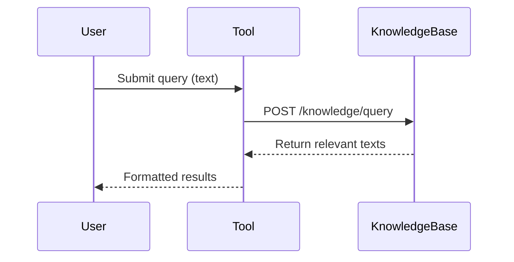
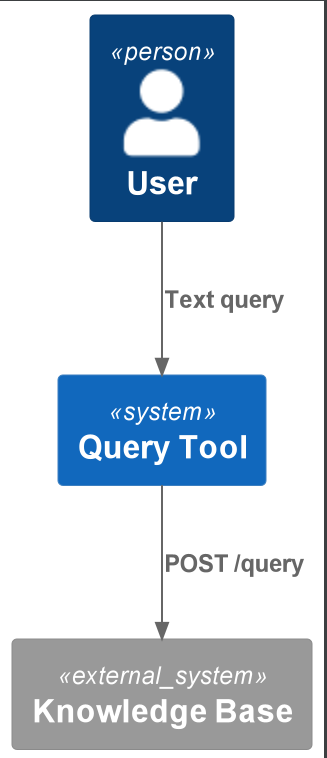

# Query Knowledge Tool

Queries Praxis's LightRAG Knowledge Base via REST API to retrieve relevant information snippets.

## Quickstart

```python
from query_knowledge_tool.main import QueryKnowledgeTool

tool = QueryKnowledgeTool()
results = tool("What is the capital of France?")
# Returns: {
#   "texts": [
#     {"text": "Paris is the capital of France..."},
#     {"text": "France's capital, Paris, is known for..."}
#   ]
# }
```

## How It Works

1. **Query Submission**: Sends text query to knowledge base API
2. **Hybrid Search**: Uses both semantic and keyword search ("hybrid" mode)
3. **Result Formatting**: Returns ranked list of text snippets

### Flow


## Source Code Links
- Key Files:
  - [main.py](https://github.com/prxs-ai/praxis-tool-examples/blob/main/tools/query-knowledge-tool/src/query_knowledge_tool/main.py) (Query execution)
  - [config.py](https://github.com/prxs-ai/praxis-tool-examples/blob/main/tools/query-knowledge-tool/src/query_knowledge_tool/config.py) (API endpoint)
  - [models.py](https://github.com/prxs-ai/praxis-tool-examples/blob/main/tools/query-knowledge-tool/src/query_knowledge_tool/models.py) (Input/Output schemas)

## Requirements & Setup

### Prerequisites
- Python ≥3.10
- Libraries: `requests`, `tenacity`, `ray`, `pydantic`, `pydantic_settings`, `requests`

### Installation
```bash
poetry install
```

### Configuration
The default API endpoint is pre-configured:
```python
API_URL = "http://praxis-dev-knowledge-base:8000/knowledge/query"
```
Override via environment variable:
```bash
export QUERY_KNOWLEDGE_TOOL_API_URL="http://custom-endpoint/knowledge/query"
```

## Architecture

### C4 Context
See [`query_knowledge_tool.puml`](./images/diagrams/query_knowledge_tool/query_knowledge_tool.puml) for a high-level sequence:



### Response Structure
```python
class OutputModel(BaseModel):
    texts: list[QueryTextResponse]  # Ordered by relevance

class QueryTextResponse(BaseModel):
    text: str  # Individual knowledge snippet
```

### Error Handling
The tool:
- Retries failed requests (5 attempts with exponential backoff)
- Validates input/output with Pydantic
- Preserves Ray workflow checkpointing

## Ray Integration
Example distributed workflow usage:
```python
import ray
from query_knowledge_tool.ray_entrypoint import main

ray.init()
result = ray.get(main.remote(query="What is AI?"))  # Returns serialized OutputModel
```

### Workflow Features
- Automatic checkpointing
- Up to 3 retries for failed executions
- Input/output validation

### Key characteristics:
1. Fixed hybrid search mode (combines semantic + keyword)
2. Simple text-in/text-out interface
3. Pre-configured for Praxis's knowledge base
4. Ray-optimized for distributed workflows
