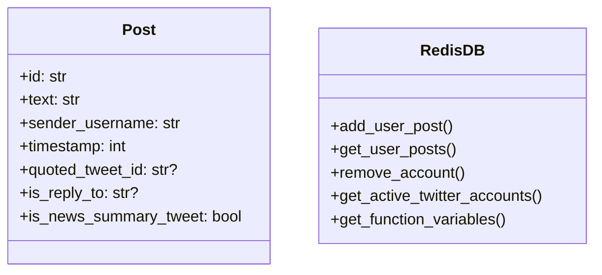
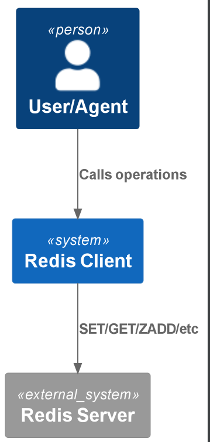

# Redis Client Tool

A robust Redis interface supporting structured data storage, Twitter operations, and distributed workflows.

## Quickstart

```python
from redis_client.main import db  # Pre-initialized instance

# Basic key-value operations
db.set("user:1001", {"name": "Alice", "active": True})
user_data = db.get("user:1001")  # Returns dict

# Twitter-specific operations
post = Post(
    id="tw123",
    text="Hello world!",
    sender_username="alice",
    timestamp=int(time.time())
)
db.add_user_post("alice", post)
recent_posts = db.get_user_posts("alice")
```

## How It Works

### Core Features
1. **Connection Management**: Auto-reconnects with timeout handling
2. **Data Serialization**: Automatic JSON encoding/decoding
3. **Structured Storage**: Specialized methods for Twitter data
4. **Distributed Ready**: Ray-compatible entry points

### Data Model


## Source Code Links
- Key Files:
  - [main.py](https://github.com/prxs-ai/praxis-tool-examples/blob/main/tools/redis_client/src/redis_client/main.py) (Primary interface)
  - [ray_entrypoint.py](https://github.com/prxs-ai/praxis-tool-examples/blob/main/tools/redis_client/src/redis_client/ray_entrypoint.py) (Distributed entry)

## Requirements & Setup

### Prerequisites
- Python ≥3.10
- Redis server (v6+ recommended)
- Libraries: `redis`, `pydantic`, `ray`, `pydantic-settings`

### Installation
```bash
poetry install
```

### Environment Variables
| Variable | Default | Description |
|----------|---------|-------------|
| `REDIS_HOST` | `localhost` | Redis server host |
| `REDIS_PORT` | `6379` | Redis server port |
| `REDIS_DB` | `0` | Database index (0=main, 1=test) |

## API Reference

### Core Methods
```python
db.set(key: str, value: Any)  # Auto-serializes to JSON
db.get(key: str) → Any        # Auto-deserializes from JSON
db.get_set(key: str) → List[str]
db.add_to_sorted_set(key: str, score: int, value: str)
```

### Twitter Operations
```python
db.add_user_post(username: str, post: Post)
db.get_user_posts(username: str) → List[Post]
db.remove_account(username: str)  # Full cleanup
db.save_tweet_link(function_name: str, tweet_id: str)
```

### Account Management
```python
db.get_active_twitter_accounts() → List[str]
db.is_account_active(username: str) → bool
db.update_account_last_action_time(username: str, action_type: str, ts: float)
```

## Architecture

### C4 Context
See [`redis_client.puml`](./images/diagrams/redis_client/redis_client.puml) for a high-level sequence:




### Key Patterns
- `twitter_data:{username}` - Account metadata
- `posted_tweets:{username}` - Sorted set of posts
- `{action_type}:{username}` - Timestamp tracking
- `created_tweet:{function}` - Tweet links queue

## Ray Integration

```python
import ray
from redis_client.ray_entrypoint import main

ray.init()
redis_proxy = ray.get(main.remote())  # Returns RedisDB instance
```

### Distributed Considerations
- Connection pooling handled per-worker
- All methods are thread-safe
- Serialization compatible with Ray object store

## Error Handling

The client automatically:
- Retries during Redis startup
- Handles connection drops
- Validates Twitter data structures
- Preserves type information through serialization

### Key features:
1. Twitter-specific data model with `Post` dataclass
2. Account lifecycle management (create/remove/query)
3. Distributed-ready through Ray
4. Structured storage for function variables and tweet links
