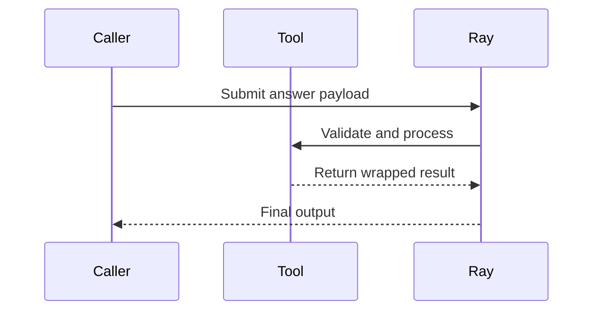

# Return Answer Tool

A pass-through utility for returning structured answers in Ray workflows, with built-in validation and serialization.

## Quickstart

```python
from return_answer_tool.ray_entrypoint import main
import ray

ray.init()
result = ray.get(main.remote({"answer": {"response": "42"}}))
# Returns: {"result": {"response": "42"}}
```

## How It Works

### Core Functionality
1. **Input Validation**: Uses Pydantic to validate JSON-serializable input
2. **Identity Operation**: Returns the input answer unchanged
3. **Result Wrapping**: Packages output in standardized format

### Workflow Integration


## Source Code
- **File**: [main.py](https://github.com/prxs-ai/praxis-tool-examples/blob/main/tools/return-answer-tool/src/return_answer_tool/main.py) (Core logic)
- **File**: [ray_entrypoint.py](https://github.com/prxs-ai/praxis-tool-examples/blob/main/tools/return-answer-tool/src/return_answer_tool/ray_entrypoint.py) (Ray interface)

## Requirements

### Prerequisites
- Python ≥3.10
- Libraries: `ray`, `pydantic`

### Installation
```bash
poetry install
```

## API Specification

### Input Model
```python
class InputModel(BaseModel):
    answer: Json[Any]  # Any JSON-serializable data
```

### Output Model
```python
class OutputModel(BaseModel):
    result: Any  # Preserves input structure
```

## Ray Integration Features

1. **Automatic Checkpointing**: 
   ```python
   @ray.workflow.options(checkpoint=True)
   ```

2. **Fault Tolerance**:
   ```python
   @ray.remote(max_retries=3, retry_exceptions=True)
   ```

3. **Type Safety**: Input/output validated by Pydantic

## Example Use Cases

1. **Workflow Passthrough**:
   ```python
   ray.get(main.remote({"answer": pipeline_result}))
   ```

2. **Result Standardization**:
   ```python
   ray.get(main.remote({"answer": {"data": ..., "metadata": ...}}))
   ```

3. **Debugging Proxy**:
   ```python
   ray.get(main.remote({"answer": intermediate_debug_data}))
   ```

## Error Handling

The tool will:
- Validate input is JSON-serializable
- Preserve exact input structure
- Retry on Ray worker failures (3 attempts)
- Maintain checkpoint consistency

### Key characteristics:
1. Minimal overhead (pure pass-through)
2. Ray workflow integration
3. Type safety without transformation
4. Debugging-friendly
