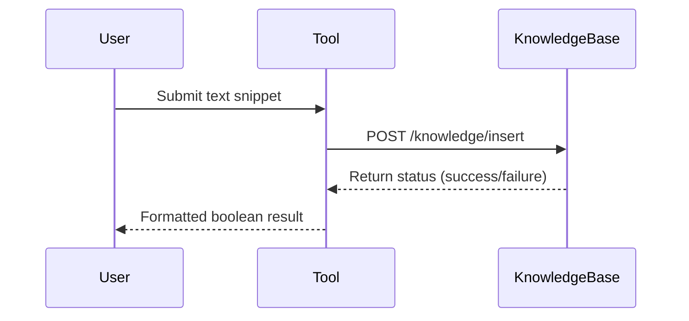

# Save Knowledge Tool

Persists text snippets into Praxis's LightRAG Knowledge Base via REST API `/insert` endpoint.

## Quickstart

```python
from save_knowledge_tool.main import SaveKnowledgeTool

tool = SaveKnowledgeTool()
result = tool("Paris is the capital of France")  
# Returns: {"result": True} on successful insertion
```

## How It Works

1. **Text Submission**: Sends text payload to knowledge base API
2. **Data Validation**: Uses Pydantic models for input/output
3. **Retry Mechanism**: 5 attempts with exponential backoff on failures

### Flow


## Source Code Links
- Key Files:
  - [main.py](https://github.com/prxs-ai/praxis-tool-examples/blob/main/tools/save-knowledge-tool/src/save_knowledge_tool/main.py) (Core insertion logic)
  - [config.py](https://github.com/prxs-ai/praxis-tool-examples/blob/main/tools/save-knowledge-tool/src/save_knowledge_tool/config.py) (API endpoint configuration)
  - [models.py](https://github.com/prxs-ai/praxis-tool-examples/blob/main/tools/save-knowledge-tool/src/save_knowledge_tool/models.py) (Data validation schemas)

## Requirements & Setup

### Prerequisites
- Python ≥3.10
- Libraries: `requests`, `tenacity`, `ray`, `pydantic`, `pydantic_settings`

### Installation
```bash
poetry install
```

### Configuration
Default API endpoint:
```python
API_URL = "http://praxis-dev-knowledge-base:8000/knowledge/insert"
```
Override via environment variable:
```bash
export SAVE_KNOWLEDGE_TOOL_API_URL="http://custom-endpoint/insert"
```

## Architecture

### C4 Context
See [`save_knowledge_tool.puml`](./images/diagrams/save_knowledge_tool/save_knowledge_tool.puml) for a high-level sequence:


### Data Models
```python
class InputModel(BaseModel):
    text: str                   # Required knowledge text
    description: Optional[str]  # Optional metadata

class OutputModel(BaseModel):
    result: bool                # Insertion status
```

### Error Handling
- Automatic retries (5 attempts)
- Request timeout: 10 seconds max
- Ray checkpointing for workflows

## Ray Integration

```python
import ray
from save_knowledge_tool.ray_entrypoint import main

ray.init()
result = ray.get(main.remote(text="AI systems learn patterns..."))  
# Returns: {"result": True}
```

### Workflow Features
- 3 automatic retries
- Input/output serialization
- Cluster-ready execution

### Key Characteristics
1. Simple text persistence interface
2. Pre-configured for Praxis's knowledge base
3. Optimized for batch operations via Ray
4. Strong input validation with Pydantic
